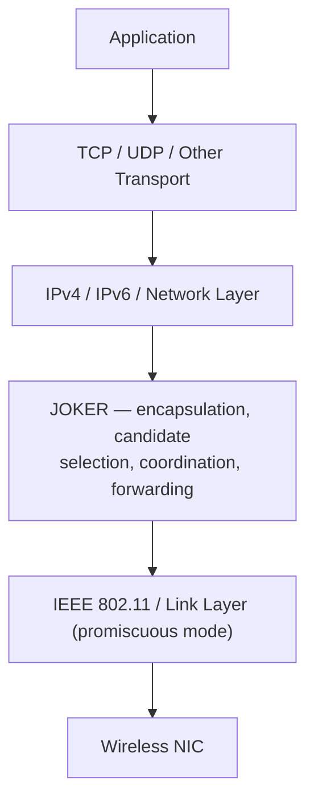
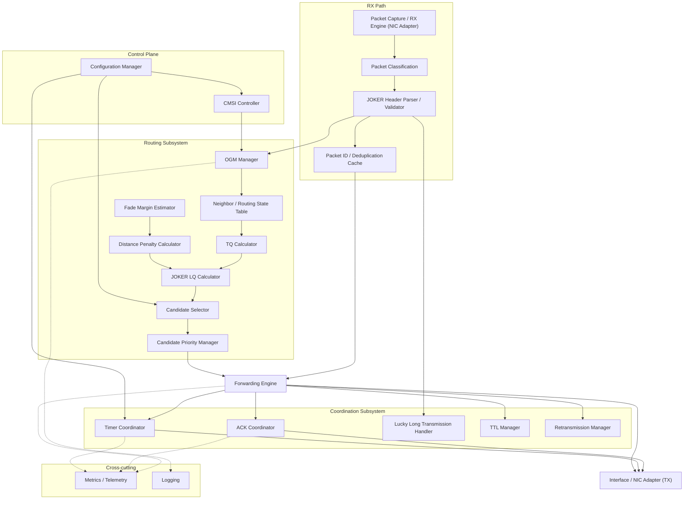
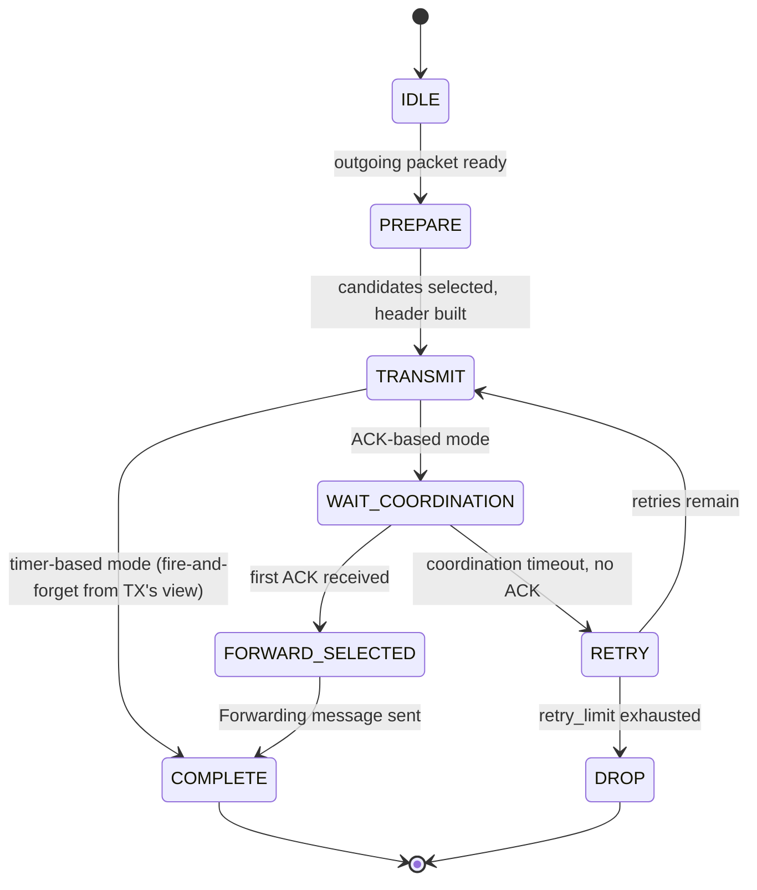
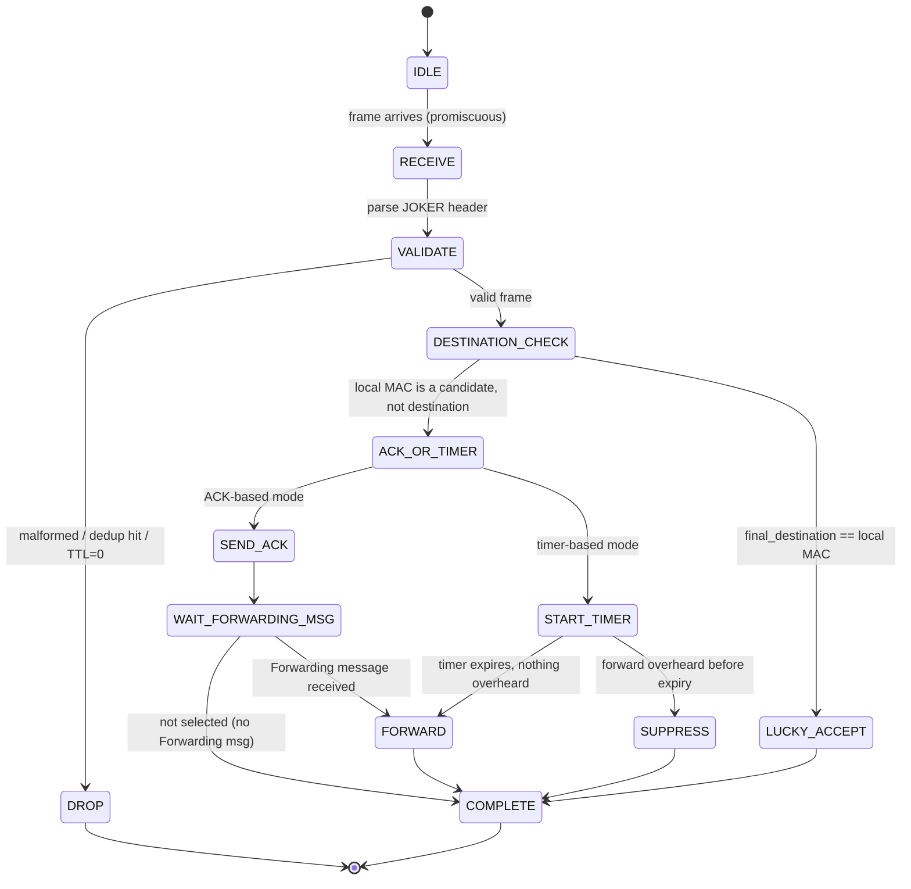

# JOKER — Architecture Specification

**Source paper:** Sanchez-Iborra, R. & Cano, M.-D., "JOKER: A Novel Opportunistic Routing Protocol," IEEE JSAC, vol. 34, no. 5, May 2016 (hereafter "the paper").

**Companion document:** `IMPLEMENTATION.md`

**Audience:** human engineers and autonomous coding agents implementing JOKER on Linux/C++20, with Android and OMNeT++ adapters.

## How to read the labels

Every non-trivial design statement in this document carries one of four tags:

- **[PAPER]** — stated explicitly in the paper (text, equation, table, or figure).
- **[DERIVED]** — a logical consequence of paper-stated behavior, not literally written out by the authors.
- **[ENGINEERING]** — a practical implementation decision required for a robust modern system, not specified by the paper.
- **[OPTIONAL]** — an enhancement that can be toggled on without altering core JOKER protocol semantics.

Where the paper is silent on something implementation requires, this document says so explicitly rather than inventing behavior silently.

---

## 1. Executive Summary

**[PAPER]** JOKER (auto-adJustable Opportunistic acKnowledgment/timEr-based Routing) is a proactive opportunistic routing protocol for IEEE 802.11 ad-hoc/mesh networks, designed to carry demanding multimedia traffic (video streaming) while reducing wireless-card energy consumption. It inherits its proactive neighbor-discovery philosophy from BATMAN (OGM broadcasting, TQ metric) but diverges from single-next-hop routing.

**The problem it solves:** Traditional proactive/reactive ad-hoc routing protocols (OLSR, AODV, BATMAN) compute a *single* next hop per destination. If that next hop's link is momentarily bad, the packet is lost or must be retransmitted end-to-end, and a link failure forces expensive route recomputation. Wireless links are broadcast in nature — a transmission is very often overheard by several neighbors, not just the intended next hop — and single-next-hop routing wastes this "free" diversity.

**Why single-next-hop routing is insufficient:** **[PAPER]** The paper's own worked example (Fig. 3) shows that when link-delivery probabilities are heterogeneous, treating multiple neighbors as a "virtual link" (opportunistic routing) yields a materially higher effective delivery ratio than committing to the single best-probability neighbor — reducing expected transmissions from 3.5 to ≈2.37 in the example topology.

**How opportunistic forwarding works:** **[PAPER]** Each node selects, per destination, a small ordered set of `Ncandidates` neighbors ("candidates") — not just one next hop. Any candidate that successfully receives a packet may forward it; coordination logic (ACK-based or timer-based) elects exactly one actual forwarder from among the candidates that received the packet, suppressing the rest.

**How JOKER balances reliability, distance progress, QoE, delay, and energy:**
- **Reliability** — **[PAPER]** candidates are ranked by a BATMAN-derived transmission-quality metric (TQ), so links that historically deliver well are favored.
- **Distance progress** — **[PAPER]** a mild `Distance_penalty`, derived from the received-signal fade margin, nudges candidate ranking toward geographically farther (but still link-reliable) neighbors, shortening the average path in hops.
- **QoE** — **[PAPER]** evaluated directly via the ITU-style MOS model (Eq. 6) against BATMAN, showing higher sustained QoE, especially under JOKER-timer coordination.
- **Delay** — **[PAPER]** timer-based coordination avoids ACK/Forwarding control-packet round trips, reducing forwarding delay versus ACK-based coordination, at the cost of possible duplicate forwarding.
- **Energy** — **[PAPER]** achieved through (a) a dynamic Control Message Sending Interval (CMSI) that lengthens the OGM broadcast period as traffic grows, cutting control-plane airtime, and (b) shorter average paths (fewer hops → fewer transmissions → less radio-on time).

---

## 2. Design Goals

| Goal | JOKER Mechanism | Label |
|---|---|---|
| Reliability | BATMAN-derived TQ metric combined across candidate "virtual link" | [PAPER] |
| Opportunistic forwarding | Multi-candidate selection + overhearing + coordination (ACK/timer) | [PAPER] |
| Reduced hop count | `Distance_penalty` biasing candidate ranking toward farther neighbors; lucky long transmission | [PAPER] |
| Reduced retransmissions | Backup candidates immediately available if primary fails | [PAPER]/[DERIVED] |
| Reduced routing overhead | Dynamic CMSI (Eq. 3); timer-based coordination injects zero control packets | [PAPER] |
| Energy efficiency | Fewer control broadcasts, fewer hops, timer coordination avoids ACK exchange, wireless card sleeps longer | [PAPER] |
| Multimedia/QoE support | Metric and coordination scheme tuned and validated against video-streaming QoE (MOS) | [PAPER] |
| Resilience to node movement | Backup candidates absorb link breakage without full route recomputation | [PAPER]/[DERIVED] |
| Resilience to link failures | Same mechanism as above; retry-limit tuning studied | [PAPER] |
| Compatibility with existing protocols | JOKER sits between link and network layers; IPv4/IPv6/UDP/TCP unmodified; standard 802.11 in promiscuous mode | [PAPER] |
| Low computational/memory requirements | Simplicity inherited from BATMAN; no GPS, no network coding | [PAPER] |

---

## 3. Complete System Architecture

### 3.A Protocol-Stack Diagram

**[PAPER]** JOKER operates between the link and network layers, encapsulating/decapsulating all regular traffic and its own control messages. Higher layers are unmodified; the link layer (802.11) is unmodified except that the NIC must run in promiscuous mode.



At a receiving node, every frame delivered by the NIC (not just frames addressed to this node's MAC, because promiscuous mode is required — **[PAPER]**) passes upward into JOKER first. JOKER classifies the frame, decides whether it is a candidate/destination/overhearer, and only passes payload up to the network layer once it is the confirmed final destination (including via lucky long transmission — **[PAPER]**).

### 3.B JOKER Internal Component Architecture

**[DERIVED]** The paper describes these responsibilities narratively (Sections III–IV); the component decomposition below is an engineering organization of that narrative, using paper terminology wherever the paper supplies it.



Module responsibilities (see `IMPLEMENTATION.md` §Project Structure for corresponding files):

- **Packet Capture / RX Engine** — **[ENGINEERING]** reads raw frames from the NIC adapter (AF_PACKET on Linux); the paper only states that a promiscuous-mode NIC is required, not a specific capture API.
- **Packet Classification** — **[PAPER]** distinguishes the three packet types the paper defines: unicast (data), ACK, Forwarding.
- **JOKER Header Parser/Validator** — **[PAPER]/[ENGINEERING]** deserializes the wire format defined in §7; validation logic itself is an engineering safeguard the paper does not specify.
- **Packet ID / Deduplication Cache** — **[PAPER]** packet ID = CRC-32 of payload, used to recognize duplicates; the cache's bounded-capacity implementation is **[ENGINEERING]**.
- **Neighbor / Routing State Table** — **[PAPER]** implied by "nodes are able to discover other nodes... and establishing routes towards them" via OGM reception.
- **OGM Manager** — **[PAPER]** builds, sends, and processes OriGinator Messages inherited conceptually from BATMAN.
- **TQ Calculator** — **[PAPER]** implements Eq. (1).
- **Fade Margin Estimator** — **[PAPER]** FM = received power − sensitivity.
- **Distance Penalty Calculator** — **[PAPER]** implements Table I mapping.
- **JOKER LQ Calculator** — **[PAPER]** implements Eq. (2).
- **Candidate Selector / Priority Manager** — **[PAPER]** ranks and selects top `Ncandidates`; priority order is an explicit paper concept used by timer-based coordination.
- **Forwarding Engine** — **[DERIVED]** central dispatcher tying classification, coordination-mode selection, and transmission together; not literally named in the paper but required by its description of end-to-end behavior.
- **ACK Coordinator / Timer Coordinator** — **[PAPER]** implement the two coordination schemes of §III-C.
- **Lucky Long Transmission Handler** — **[PAPER]** accept-if-final-destination logic.
- **TTL Manager** — **[PAPER]** TTL default 32, decremented per hop, packet dropped at 0.
- **Retransmission Manager** — **[PAPER]** "the number of retransmissions that a node attempts if a packet is not received by the next hop" is an explicit tunable parameter; the paper does not specify the internal retry state machine in detail, so its scheduling is **[ENGINEERING]**.
- **CMSI Controller** — **[PAPER]** implements Eq. (3) and reschedules OGM broadcast.
- **Configuration Manager, Metrics/Telemetry, Logging** — **[ENGINEERING]**, required for any production-quality implementation but not discussed by the paper.

---

## 4. Data Flow Architecture

### 4.A Main data packet lifecycle

**[PAPER]/[DERIVED]** Synthesized from §III-A–C and Fig. 2.

```text
Application packet
        ↓
Packet capture (own outgoing traffic) OR NIC RX (promiscuous)
        ↓
Destination identification (final-destination MAC in JOKER header)
        ↓
Candidate lookup (routing/neighbor state table, keyed by destination)
        ↓
Candidate selection (top Ncandidates by LQ, priority-ordered)
        ↓
JOKER encapsulation (header inserted between network and link headers;
        highest-priority candidate MAC placed in link-layer header, not JOKER header)
        ↓
Transmission (unicast to highest-priority candidate's MAC; overheard by others)
        ↓
Candidate reception (each candidate that receives the frame processes it)
        ↓
Coordination (ACK-based OR timer-based — configured per deployment)
        ↓
Forwarder election (exactly one candidate becomes the actual forwarder)
        ↓
Forward (repeat pipeline from "Candidate lookup" at the new node)
        ↓
... repeats until destination reached (directly or via lucky long transmission)
```

### 4.B Special flows

**1. ACK-based coordination [PAPER]**
```text
TX → DATA (unicast to top candidate, overheard by all candidates)
Each receiving candidate → ACK(packet_id) → TX  (no priority ordering, first-come)
TX receives first ACK → sends Forwarding(packet_id) → that candidate only
Selected candidate forwards the DATA packet
```

**2. Timer-based coordination [PAPER]**
```text
Candidate receives DATA
    wait = twait × (priority − 1)
    during wait: listen to medium
    if forwarding of this packet_id overheard from another candidate:
        suppress own forward
    else, at timer expiry:
        forward
```

**3. Lucky long transmission [PAPER]**
```text
On receiving ANY frame whose JOKER header final-destination == local MAC:
    accept immediately, decapsulate, deliver to network layer
    (regardless of whether this node was an intended candidate)
```

**4. Duplicate packet reception [PAPER]/[ENGINEERING]**
```text
On receiving a DATA frame:
    if packet_id already in seen-cache (within TTL/expiry window):
        drop (do not re-forward, do not re-process)
    else:
        insert into seen-cache; process normally
```
The paper acknowledges duplicates can occur under timer-based coordination when a lower-priority candidate fails to overhear a higher-priority one's forward — deduplication at the receiver is the paper-implied mitigation; the cache's concrete bounded design is **[ENGINEERING]**.

**5. TTL expiry [PAPER]**
```text
if ttl == 0: drop packet (never forward)
else: ttl -= 1; continue forwarding pipeline
```

**6. Forwarding failure / candidate failure [PAPER]/[DERIVED]**
```text
If the elected forwarder does not successfully transmit (e.g., link-layer ACK
absent / max 802.11 retries exhausted):
    the transmitting node still holds backup candidates ready
    → next-priority candidate takes over (this is the core opportunistic-routing
      advantage described qualitatively in §III-D, point 3)
```
The paper does not give an explicit state machine for "candidate failure hand-off" at the JOKER-protocol level (as opposed to node/link failure generally) — the hand-off mechanics are **[DERIVED]** from the general opportunistic-routing rationale and must be made concrete in engineering (see §13 Failure Handling).

**7. Retransmission exhaustion [PAPER]**
```text
if retransmission_count >= retry_limit:
    drop packet
```
`retry_limit` is an explicit tunable studied experimentally (Fig. 8), tied to the underlying 802.11 retry limit in the paper's experiments — **[PAPER]** as a tunable concept, **[ENGINEERING]** as to exactly how JOKER-level retries interact with MAC-level retries in a from-scratch implementation (see §13).

**8. Destination reached [PAPER]**
```text
Frame with final-destination == local MAC arrives (via normal forwarding or
lucky long transmission) → decapsulate → deliver payload to network layer
→ no further JOKER-level action (no ACK required back to origin at the
  JOKER layer, beyond intra-hop ACK/timer coordination already used to reach it)
```

**9. OGM processing [PAPER]**
```text
Node periodically (per CMSI) broadcasts an OGM (its own existence).
On receiving an OGM (own or relayed):
    update neighbor/routing state for the originator via this link-local neighbor
    selectively rebroadcast per BATMAN-inherited OGM propagation logic
```

---

## 5. Packet Architecture

**[PAPER]** The paper defines three packet types carried under the JOKER packet-type field, plus the routing control message (OGM), which the paper states "has its own format" separate from the JOKER data header.

### 5.1 Unicast (Data) Packet

| Property | Value |
|---|---|
| Purpose | Carry encapsulated higher-layer payload toward final destination |
| Sender | Origin node or any intermediate forwarder |
| Receiver | Link-layer unicast to top-priority candidate; overheard by other candidates and any node in range |
| Fields | Full JOKER header (type, TTL, packet-id, destination MAC, candidate list minus top candidate) |
| Candidates present | Yes — `Ncandidates − 1` in the JOKER header; top candidate is in the link-layer header |
| Broadcast/unicast | Link-layer unicast (opportunistically overheard due to shared medium) |
| Lifecycle | Forwarded hop-by-hop, TTL-decremented, until destination or lucky-long acceptance, or TTL/retry exhaustion |
| Failure behavior | Backup candidate takes over on primary failure; dropped on TTL=0 or retry exhaustion |

### 5.2 ACK Packet

| Property | Value |
|---|---|
| Purpose | Confirm receipt of a specific data packet by a candidate, in ACK-based coordination |
| Sender | Any candidate that received the DATA packet |
| Receiver | The transmitter of the DATA packet (unicast) |
| Fields | **[PAPER]** packet-id only; **[PAPER]** explicitly "without any candidates in the JOKER header," to reduce size and avoid control-packet storms |
| Candidates present | No |
| Broadcast/unicast | Unicast |
| Lifecycle | Sent immediately on DATA receipt, no priority ordering — first received by TX wins |
| Failure behavior | If lost (e.g., due to fading), TX never selects that candidate for this packet; if no ACK is ever received, DATA packet must eventually be treated as failed (see §13 — retransmission/backup, **[DERIVED]** mechanics) |

### 5.3 Forwarding Packet

| Property | Value |
|---|---|
| Purpose | Instruct the winning candidate (first ACK sender) to actually forward the DATA packet |
| Sender | The original DATA transmitter |
| Receiver | The candidate whose ACK arrived first (unicast) |
| Fields | **[PAPER]** packet-id, no candidate list (same size-reduction rationale as ACK) |
| Candidates present | No |
| Broadcast/unicast | Unicast |
| Lifecycle | Sent once per DATA packet in ACK-based mode, after first ACK is received |
| Failure behavior | If lost, the elected candidate never forwards; **[DERIVED]** engineering must define a timeout/fallback (paper does not specify) |

### 5.4 OGM / Control Packet

| Property | Value |
|---|---|
| Purpose | Proactive neighbor/route discovery, inherited conceptually from BATMAN |
| Sender | Every node, periodically |
| Receiver | Broadcast to all link-local neighbors |
| Fields | **[PAPER]** not detailed at wire-field level by the paper beyond "a simple packet to make the other nodes in the network know about its existence"; BATMAN-style OGM fields (originator address, sequence number, TQ-relevant info) are **[DERIVED]** from the stated BATMAN lineage, not literally specified |
| Candidates present | N/A |
| Broadcast/unicast | Broadcast |
| Lifecycle | Sent every CMSI (Eq. 3), selectively rebroadcast by receivers per BATMAN logic |
| Failure behavior | Lost OGMs degrade route freshness gradually (proactive protocols are inherently tolerant of occasional control-packet loss); stale-neighbor expiry is **[ENGINEERING]** |

**Gap note:** The paper does not give a byte-level OGM format (unlike the JOKER data header, which is fully specified — see §7). `IMPLEMENTATION.md` proposes a concrete OGM wire format as **[ENGINEERING]**, modeled on BATMAN's OGM while carrying whatever fields JOKER's TQ/LQ pipeline needs (originator MAC, sequence/TTL, TQ-relevant counters).

---

## 6. JOKER Header Specification

**[PAPER]** Exact structure per Fig. 1 and accompanying text (§III-A):

| Field | Description | Size |
|---|---|---|
| Packet type | Unicast / ACK / Forwarding | implementation-defined width, paper does not give exact bit width — **[ENGINEERING]** choice: 1 byte |
| TTL | Hops remaining before discard, default 32 | 1 byte (paper: "usual figure of 32," fits in 1 byte) |
| Packet ID | CRC-32 of payload, uniquely identifies the packet | 4 bytes **[PAPER]** |
| Final destination address | MAC address of the ultimate receiver | 6 bytes |
| Candidate 2..N addresses | MAC addresses of all candidates **except** the highest-priority one | 6 bytes × (Ncandidates − 1) |

**[PAPER] Protocol invariant — overhead formula:**

```text
JOKER header overhead = 12 + 6 × (Ncandidates − 1) bytes
```

This is a hard invariant: 12 bytes covers packet-type + TTL + packet-id (implied 1+1+4=6... see note below) + destination MAC, plus 6 bytes per extra candidate beyond the first. **Do not casually change the wire format** — any change to field widths or the header layout must be documented as an explicit, versioned deviation, not a silent modernization.

> **Byte-accounting note [DERIVED]:** The paper states the fixed portion is 12 bytes and gives no field-by-field byte breakdown beyond "packet type," "TTL," "packet-id (4 bytes)," "final destination address," and "candidate address(es)." A destination MAC alone is 6 bytes; 4 (packet-id) + 6 (destination MAC) = 10, leaving 2 bytes for packet-type + TTL combined to reach the paper's stated 12-byte fixed overhead. `IMPLEMENTATION.md` therefore allocates 1 byte to packet-type and 1 byte to TTL as the **[ENGINEERING]** resolution consistent with the paper's 12-byte total; if a future re-reading of the original figure indicates different field widths, this note must be updated and the wire format versioned.

**[PAPER]** The highest-priority candidate's MAC address is **not** placed in the JOKER header at all — it is passed down as an input parameter to the link layer, which places it in its own (802.11) header's destination field. This is explicitly done to reduce JOKER header size and preserve compatibility with the link layer, and it is also what allows JOKER to degrade gracefully to single-next-hop routing when `Ncandidates = 1` (no JOKER-header candidate list at all).

**[OPTIONAL]** A modern extensible header (e.g., TLV-based, for future fields such as authentication) may be defined as a compatibility extension activated by a reserved packet-type value, but it must never replace or reinterpret the paper's base format above.

---

## 7. Routing Metric Architecture

**[PAPER]** Full pipeline, from BATMAN-inherited TQ to JOKER's LQ:

```text
TQ = TQlocal × TQrecv × fasym × hop_penalty         (Eq. 1)

LQ = TQ × (TQmax − Distance_penalty) / TQmax        (Eq. 2)
```

| Symbol | Meaning | Source |
|---|---|---|
| `TQlocal` | Transmission quality computed locally toward a direct neighbor, on the path to the final destination | Local link measurement, inherited from BATMAN [PAPER] |
| `TQrecv` | Transmission quality computed *by that direct neighbor* toward the final destination | Learned via OGM from the neighbor [PAPER] |
| `fasym` | Penalty for asymmetric links | BATMAN-inherited [PAPER]; exact formula not given in the JOKER paper — inherit BATMAN's definition, flagged **[DERIVED]** |
| `hop_penalty` | Penalty for longer paths | BATMAN-inherited [PAPER]; exact formula not given in the JOKER paper — **[DERIVED]** from BATMAN |
| `TQmax` | Normalization ceiling for TQ, default 255 | [PAPER] |
| `Distance_penalty` | Penalty derived from fade margin (Table I) | [PAPER] |

**Update process [DERIVED]:** TQ values are refreshed as OGMs are received and relayed (proactive, continuous), consistent with BATMAN's operating model; the JOKER paper does not restate BATMAN's TQ update algorithm in full and it must be treated as inherited, not reinvented.

**Normalization:** LQ is bounded above by TQ (since `(TQmax − Distance_penalty)/TQmax ≤ 1` for `Distance_penalty ≥ 0`), and the paper explicitly notes the tuning is "so mild that it does not have enough weight in the LQ calculation to modify very much the value of TQ" — **[PAPER]**, an explicit design intent, not an incidental property. Reliability (TQ) dominates; distance progress only breaks near-ties among similarly reliable candidates.

**Candidate ranking:** **[PAPER]** candidates for a given destination are sorted by descending LQ; the top `Ncandidates` are selected; priority 1 = highest LQ.

**Tie-breaking:** **[ENGINEERING]** — not specified by the paper. Recommended: deterministic tie-break by ascending MAC address, to guarantee reproducible candidate ordering across nodes and simulation runs.

**Invalid/stale metric handling:** **[ENGINEERING]** — neighbors with no recent OGM (beyond a configurable expiry) must be excluded from candidate selection; the paper does not specify an expiry timeout, so this is a recommended safeguard, not a paper requirement.

---

## 8. Fade Margin and Distance Progress

**[PAPER]**
```text
Fade Margin (FM) = Received Power (dBm) − Receiver Sensitivity (dBm)
```

**[PAPER] Table I — Distance_penalty mapping:**

| Fade Margin | Progress interpretation | Distance_penalty |
|---|---|---|
| FM < 10 dB | High progress (weak signal ⇒ likely a farther node) | 1 |
| 10 dB ≤ FM ≤ 20 dB | Medium progress | 3 |
| FM > 20 dB | Low progress (strong signal ⇒ likely a nearby node) | 5 |

**The counterintuitive design, explained [PAPER]:**
- A weaker received signal (smaller FM... note the paper's convention: *low* FM here actually corresponds to a node whose received power is comparatively low relative to what a very close node would produce, which the paper associates with *higher* geographic progress and hence the *lowest* penalty). The paper explicitly frames this as: many routing protocols maximize link strength and end up favoring the nearest neighbors, producing paths with many short hops. JOKER instead **rewards** the neighbors that appear farthest away (weaker signal, larger fade margin *relative to a close node's strong signal*... — see caution below) because they contribute more geographic progress per hop, reducing total hop count, collisions, and delay.
- Reliability remains dominant: the `Distance_penalty` values (1, 3, 5) are small relative to the TQ scale (`TQmax = 255`), so this factor never overrides a genuinely unreliable link — it only breaks ties among reliable candidates in favor of the more distant one.
- **[PAPER]** JOKER does **not** use GPS or any geographic-coordinate information; "distance progress" is inferred purely from received-signal fade margin, not from position.

> **Caution — directional consistency [DERIVED]:** The paper's Table I associates low FM with high progress and penalty 1, and high FM with low progress and penalty 5. Implementers should verify sign/direction against the paper's Fig. 1/Table I image at integration time rather than re-deriving from prose alone, since fade margin conventions (whether larger FM means a stronger or weaker link margin) vary across the wireless literature. This document reproduces the paper's stated table verbatim; do not "fix" the direction based on outside intuition.

---

## 9. Candidate Selection

**[PAPER]/[DERIVED]** Full algorithm, synthesized from §III-B:

```text
Input:
    destination                  # final destination MAC
    neighbor_state                # routing/neighbor table (from OGM processing)
    Ncandidates                   # configured candidate-set size

eligible = { n in neighbor_state.neighbors
             : n.has_route_to(destination)          # [DERIVED] — a neighbor must
                                                      #   have a known path toward
                                                      #   the destination to be
                                                      #   eligible; the paper implies
                                                      #   this via OGM-based route
                                                      #   discovery but does not spell
                                                      #   out an eligibility predicate
             and n.is_fresh()      }                 # [ENGINEERING] — non-stale

for each neighbor n in eligible:
    TQ_n  = calculate_tq(n, destination)              # Eq. 1  [PAPER]
    FM_n  = calculate_fade_margin(n.rx_power, sensitivity)   # [PAPER]
    DP_n  = distance_penalty(FM_n)                    # Table I [PAPER]
    LQ_n  = TQ_n × (TQmax − DP_n) / TQmax              # Eq. 2  [PAPER]

sort eligible by descending LQ                          # [PAPER]
break ties by ascending MAC address                      # [ENGINEERING]

candidates = top Ncandidates of sorted list               # [PAPER]

assign priority:
    candidates[0].priority = 1     # highest priority
    candidates[1].priority = 2
    ...
    candidates[Ncandidates-1].priority = Ncandidates

# candidates[0] (priority 1) is placed in the LINK-LAYER header, not the
# JOKER header  [PAPER]
# candidates[1..Ncandidates-1] are placed in the JOKER header candidate list [PAPER]
```

**Exclusion rules [DERIVED]:** the packet's previous hop should not be re-selected as a forwarding candidate for the same packet (loop avoidance); the paper does not state this explicitly but it follows necessarily from any sane forwarding design and from TTL-bounded forwarding semantics. Flag as **[DERIVED]**, and implement as an engineering safeguard.

**Stale neighbor handling:** **[ENGINEERING]** — exclude neighbors whose last OGM exceeds an expiry threshold (not specified numerically by the paper).

**Candidate uniqueness:** **[DERIVED]** the candidate list for a single packet must contain no duplicate MAC addresses; trivially true if candidate selection sorts over a set of distinct neighbors.

**Complexity analysis [ENGINEERING/DERIVED]:**
- Computing TQ/FM/DP/LQ for each eligible neighbor: O(E) where E = number of eligible neighbors for the destination.
- Sorting: O(E log E).
- Selecting top `Ncandidates`: O(E) with a partial sort / min-heap of size `Ncandidates`, or O(E log E) with a full sort (acceptable given E is bounded by node degree, typically small in ad-hoc deployments).
- Overall per-packet candidate-selection cost: O(E log E), dominated by sort; recommend partial-selection (`nth_element` + sort of top-k) for O(E + k log k) when node degree is large.

---

## 10. CMSI Architecture

**[PAPER]**
```text
CMSI = 0.006 × TP + 1.5
```
where `TP` is throughput (kbps) currently crossing the node.

**Why adaptive [PAPER]:** Fixed control-message intervals (as in most ad-hoc routing protocols, including BATMAN's default 1 s) are wasteful under high traffic load, where OGM broadcast volume compounds with data volume. JOKER instead grows its OGM interval as node throughput grows, so control-plane overhead per unit of carried traffic shrinks rather than growing unboundedly.

**Relationship to traffic load [PAPER]:** At `TP = 0` kbps (idle node), CMSI = 1.5 s — already 50% longer than BATMAN's fixed 1 s default, giving the paper's cited "at least 33%" reduction in control packets even in the *least* advantageous case for JOKER. As `TP` grows, CMSI grows further, linearly.

**Control-plane overhead [PAPER]:** Eq. (5) gives network-wide control overhead:
```text
O_BATMAN = CP × N               (CMSI fixed at 1 s)
O_JOKER  = CP × N / (0.006 × TP + 1.5)
```
where `CP` is per-node control packets per CMSI period (modeled by Eq. 4 for a Manhattan-grid topology) and `N` is node count. **[PAPER]** Fig. 4 shows JOKER's overhead grows much more slowly with node count and throughput than BATMAN's uncontrolled growth.

**Energy implications [PAPER]:** Fewer, less frequent OGM broadcasts → NIC can spend more time in low-power/sleep state → directly supports the paper's energy-efficiency goal.

**Scheduling architecture [ENGINEERING]:** the paper does not specify how CMSI is implemented as software (thread vs. event loop vs. timer wheel); this is a pure engineering decision. Recommended: a single-threaded event-loop timer, recalculated at each expiry based on the most recently measured throughput, avoiding a dedicated OGM thread (see §17 Concurrency Architecture).

**Minimum CMSI behavior [PAPER]:** the theoretical minimum is 1.5 s at zero throughput; there is no paper-stated maximum, so CMSI can, in principle, grow unbounded under sustained extremely high throughput. **[ENGINEERING]** recommendation: apply a configurable maximum CMSI clamp to bound route staleness under pathological load, documented as an engineering safeguard, not a paper requirement.

**CMSI scheduler pseudocode [ENGINEERING], protocol values [PAPER]:**
```text
function cmsi_scheduler_tick():
    tp = measure_recent_throughput_kbps()      # [ENGINEERING] measurement window
    interval_s = 0.006 * tp + 1.5               # [PAPER] Eq. 3
    interval_s = clamp(interval_s, MIN_CMSI, MAX_CMSI)   # [ENGINEERING] clamp
    schedule_next_ogm_broadcast(now() + interval_s)

on ogm_timer_fires():
    ogm = ogm_build()                            # [PAPER]
    ogm_send(ogm)                                # [PAPER]
    cmsi_scheduler_tick()                        # reschedule based on fresh TP
```

---

## 11. Coordination Architecture

### 11.A ACK-based [PAPER]

```text
TX
 ↓ DATA (unicast to top-priority candidate; JOKER header carries remaining
 ↓        candidates; overheard by all candidates in range)
Candidates receive
 ↓
Each candidate → ACK(packet_id) → TX     (no priority in ACK timing —
 ↓                                        first received wins)
TX receives first ACK
 ↓
TX → Forwarding(packet_id) → sender of that first ACK
 ↓
Selected candidate forwards DATA
```

Notes:
- **[PAPER]** "there is no distinction among candidates" in ACK timing — this is intentional, to minimize delay: whichever candidate replies fastest (best current link state to TX) wins, regardless of its precomputed priority. Candidate *priority* from the selection algorithm still determines the *initial* candidate set and who gets to attempt forwarding at all, but not who wins the coordination race.
- **[PAPER]** ACK and Forwarding packets carry no candidate list (size/overhead reduction, avoids control-packet storms).
- **[PAPER]** Additional control overhead: 2 extra unicast control packets per hop (ACK + Forwarding) versus timer-based coordination's zero.
- **[PAPER]** Reliability advantage: duplicated packets are reduced to 0, since only the explicitly-instructed candidate forwards.
- **[PAPER]** Delay disadvantage: two additional control round-trip legs per hop.

### 11.B Timer-based [PAPER]

```text
wait = twait × (priority − 1)
```
```text
Candidate receives packet
        ↓
Start timer for `wait` ms
        ↓
Listen to channel during wait
        ↓
If forwarding of this packet_id heard from another candidate:
    suppress own forwarding
Else, at timer expiry:
    forward packet
```

Notes:
- **[PAPER]** priority-1 (highest priority) candidate has `wait = 0` and forwards immediately upon full reception.
- **[PAPER]** lower-priority candidates overhear the higher-priority candidate's transmission (broadcast nature of the medium) and, if heard, suppress their own forward.
- **[PAPER]** duplicate forwarding *can* occur if a lower-priority candidate fails to overhear the higher-priority candidate's transmission before its own timer expires (e.g., due to a fading channel or being just out of range of that specific transmission).
- **[PAPER]** trade-off: smaller `twait` → less delay but higher duplicate-forwarding risk (less time to overhear); larger `twait` → more delay if the top candidate fails, but calmer suppression behavior.
- **[PAPER]** the paper's own experiments (Table IV) found **50 ms** to be the best-performing `twait` value in its evaluated Nakagami-m, video-streaming scenario with 2 candidates. **This is an experimental result for that scenario, not a universal optimum** — do not hardcode 50 ms as "the correct value of twait" without noting it is a tuned default.

---

## 12. Lucky Long Transmission

**[PAPER]**
```text
On receiving any frame (from any transmission, whether or not this node was
an intended candidate):
    if frame.joker_header.final_destination == local_MAC:
        accept the packet immediately
        do NOT wait for an intermediate candidate to forward it
        decapsulate and deliver to network layer
```

**Why it matters [PAPER]:** In the paper's worked example (Fig. 3, §III-D point 2), 1 out of 5 packets directly reaches RX from TX due to the shared-medium broadcast nature of the link — a "lucky long" hop. BATMAN, having no candidate concept, would discard this valid reception at the network layer (since BATMAN only accepts from the expected single next hop) and wait for the intermediate node to forward the duplicate, adding unnecessary delay and even risking incorrectly dropping a valid packet. JOKER, having the destination address in every JOKER header, lets the true destination recognize and accept the packet on the spot, cutting delay and hop count. This mechanism is also cited by the paper as a direct contributor to JOKER's shorter average path lengths (Table V).

---

## 13. Failure Handling

### Paper-defined behavior

| Failure | Paper-defined behavior |
|---|---|
| TTL expiry | **[PAPER]** packet dropped when TTL reaches 0 |
| Missing ACK (ACK-based mode) | **[PAPER]** implied: if no candidate ACKs, TX has no forwarder to instruct — paper does not give an explicit timeout/retry state machine for this case beyond the general "retransmissions" tunable |
| Link/node failure mid-route | **[PAPER]** qualitatively described (§III-D point 3): a backup candidate is "ready to automatically forward the packet if the primary forwarder fails," avoiding BATMAN's costly route recomputation |
| Retransmission exhaustion | **[PAPER]** retry limit is an explicit tunable (evaluated in Fig. 8 against the 802.11 MAC retry limit); packet dropped once exhausted |
| Duplicate forwarding (timer-based) | **[PAPER]** explicitly acknowledged as a possible side effect when a lower-priority candidate fails to overhear a higher-priority forward |

### Recommended engineering safeguards (not paper-specified)

| Failure | Recommended safeguard | Label |
|---|---|---|
| Missing ACK / missing Forwarding message | Bound the wait with a timeout; on timeout, fall back to the next-priority candidate or trigger a JOKER-level retransmission, up to `retry_limit` | [ENGINEERING] |
| Candidate disappearing (no longer a valid neighbor) | Remove from neighbor table on OGM-expiry timeout; exclude from future candidate selection; do not target it mid-flight if detected before send | [ENGINEERING] |
| Stale route | Expire neighbor-table entries; recompute candidate sets from fresh OGM data on next selection | [ENGINEERING] |
| Duplicate packet / replay | Bounded packet-ID cache with TTL-based expiry (§9 in `IMPLEMENTATION.md`); reject already-seen packet IDs | [ENGINEERING] (mitigates a [PAPER]-acknowledged phenomenon) |
| Corrupted packet / malformed header | Validate header fields (lengths, packet-type enum, TTL range) before any processing; drop and log, never forward | [ENGINEERING] |
| Unknown packet type | Drop and log; never forward | [ENGINEERING] |
| Invalid candidate list (e.g., duplicate MACs, self-MAC as candidate) | Validate on deserialization; drop malformed frames | [ENGINEERING] |
| Destination unreachable (no eligible candidates) | Drop at origin (or intermediate) with a clear "no route" outcome, logged and countable via metrics | [ENGINEERING] |

**Explicit non-alteration statement:** none of the safeguards above change paper-defined *forwarding semantics* (who gets to forward, in what order, under what coordination scheme) — they only bound resource use and reject malformed/expired input, which the paper's high-level description assumes implicitly (a "real" implementation cannot process unbounded or corrupt state).

---

## 14. State Machines

### 14.A Sender


`WAIT_COORDINATION`/`RETRY` are only exercised in ACK-based mode; timer-based mode's TX role ends at `TRANSMIT` since coordination happens entirely among candidates. **[DERIVED]** state names, **[PAPER]**-sourced transitions.

### 14.B Candidate



### 14.C OGM Subsystem

```mermaid
stateDiagram-v2
    [*] --> INIT
    INIT --> WAIT_CMSI: compute initial CMSI (TP=0 → 1.5s)
    WAIT_CMSI --> BROADCAST: timer expires
    BROADCAST --> UPDATE: OGM sent; also process any received OGMs
    UPDATE --> RESCHEDULE: recompute CMSI from current throughput
    RESCHEDULE --> WAIT_CMSI
```



---

## 15. Concurrency Architecture

**[ENGINEERING]** — the paper does not discuss threading/concurrency; the following is a recommended, defensible design for a modern C++20 implementation.

**Paths that must coexist:**
- RX path (packet capture → classification → processing)
- TX path (forwarding engine → NIC transmission)
- OGM scheduler (periodic, CMSI-driven)
- CMSI recalculation (driven by throughput measurement, tied to OGM scheduler)
- Timer coordination (many concurrent per-packet forward timers in timer-based mode)
- Neighbor-state updates (triggered by OGM RX)
- Configuration reload (infrequent, external trigger)
- Metrics collection (continuous, low-overhead)

**Recommended model:** a single-threaded (or small fixed-pool) **event-driven reactor** built around an epoll/io_uring-style event loop, rather than a thread per concern:

- One event loop thread owns: NIC RX/TX file descriptors, the OGM/CMSI timer, and a timer wheel for per-packet forward/ACK-wait timers.
- The neighbor table, packet-ID dedup cache, and candidate-selection logic are **not** accessed concurrently from multiple threads under this model — eliminating most lock requirements.
- An optional bounded worker pool may be used only for CPU-heavy, parallelizable work (e.g., CRC-32 computation over large payloads) — dispatched from and returned to the event loop via a lock-free or mutex-protected bounded queue.

**Shared state, if a multi-threaded variant is chosen instead:**

| State | Access pattern | Recommended protection |
|---|---|---|
| Neighbor/routing table | Read-heavy (candidate selection), write on OGM RX | `shared_mutex` (reader-writer) or single-writer-thread + lock-free reads via RCU-like snapshotting |
| Packet-ID dedup cache | Read+insert on every RX | Sharded mutex or lock-free bounded ring buffer keyed by hash |
| Active forward timers | Insert/cancel frequently | Timer wheel with its own lock, or owned exclusively by the event-loop thread |
| CMSI / throughput counters | Written by RX/TX paths, read by OGM scheduler | Atomics (relaxed increment, acquire/release on read for scheduling decisions) |
| Configuration | Rarely written, frequently read | Copy-on-write snapshot pointer swapped atomically (e.g., `atomic<shared_ptr<Config>>`) |

**Ownership/lifetime:** neighbor entries and pending-timer objects should be owned by the tables/timer-wheel that manage their lifecycle, referenced elsewhere by stable IDs (not raw pointers) to avoid use-after-free when entries expire mid-flight.

**Timer cancellation:** when a forward is suppressed (timer-based mode, overheard higher-priority forward) or when an ACK arrives after already timing out, in-flight timers must be cancelled cleanly and idempotently — cancellation racing with expiry must be handled without double-firing.

**Shutdown:** the event loop must drain in-flight timers and pending TX before closing the NIC adapter; abrupt shutdown should still leave the dedup cache and neighbor table in a state safe to discard (no external durability requirement, per the paper's stateless-ish proactive design).

---

## 16. Performance and Scalability

**[DERIVED]/[ENGINEERING]** — the paper gives some overhead scaling (Eq. 4/5, Fig. 4) but not a full complexity analysis; this section extends it.

| Aspect | Cost | Notes |
|---|---|---|
| Candidate selection per packet | O(E log E), E = eligible neighbor count | See §9; dominated by sort, can be reduced to O(E + k log k) with partial selection |
| Packet processing (RX) | O(1) amortized per frame | Header parse + dedup-cache lookup (hash-map) + neighbor lookup (hash-map) |
| OGM overhead | O(CP·N / CMSI), per Eq. 5 [PAPER] | Grows sub-linearly with throughput vs. BATMAN's linear-in-N-only growth, because CMSI itself grows with TP |
| ACK overhead (ACK-mode) | 2 extra unicast frames per hop | [PAPER] |
| Timer overhead | O(1) timer per candidate per received packet, bounded by `Ncandidates` | [ENGINEERING] estimate |
| Duplicate-suppression memory | O(cache capacity), bounded, LRU/TTL-evicted | [ENGINEERING] — paper does not bound this; unbounded caches are unacceptable in production |
| Scalability with node count (N) | Neighbor table grows O(N) in the worst case (fully connected); realistic ad-hoc degree is much smaller | [DERIVED] |
| Scalability with candidate count (Ncandidates) | Header overhead grows linearly (§7); candidate-selection cost grows with sort size; duplicate-forwarding risk grows in timer-mode as noted in [PAPER] Fig. 6 discussion | [PAPER]/[DERIVED] |

**[PAPER]** Practical finding: larger `Ncandidates` (specifically 4, in the paper's tests) generally **underperforms** 2–3 candidates under heavy multimedia load, because increased duplicate-forwarding probability and (in ACK-mode) increased control-packet collision probability outweigh the reliability benefit of more candidates. This is an empirical result, not a universal law — do not treat "more candidates = better" as an implementation assumption.

---

## 17. Security / Robustness

**[PAPER]** The original paper is **not** a security protocol and makes no security claims. JOKER as specified has no authentication, integrity protection, or replay protection for any packet type (data, ACK, Forwarding, OGM).

### Potential threats (not addressed by the paper)

- Forged OGM (false route/neighbor advertisement)
- Fake link-quality information (manipulated TQ/FM inputs to bias candidate selection)
- Malicious candidate injection (attacker inserts itself into a candidate list it should not be part of)
- Duplicate packet flooding (replay of valid packet IDs to waste dedup-cache/processing resources)
- Packet replay (resending old, previously-valid DATA/ACK/Forwarding frames)
- Malformed packet attacks (crafted headers designed to trigger parser bugs)
- Neighbor poisoning (flooding fake neighbor entries to exhaust routing-table memory)
- Resource exhaustion (unbounded state growth via any of the above)

### [OPTIONAL] Hardening mechanisms (engineering extensions, not part of the paper)

- Authenticated control packets (e.g., HMAC over OGM/ACK/Forwarding payloads with a pre-shared or PKI-derived key)
- Packet integrity (beyond the existing CRC-32, which is an *identifier*, not a security integrity check — a CRC-32 is trivially forgeable and must never be treated as an authentication mechanism)
- Replay protection (sequence numbers + freshness windows on OGMs; nonce or timestamp binding on data packets)
- Rate limiting (per-neighbor OGM/ACK rate caps)
- Bounded state (already required generally — see §13/§15 — but explicitly framed here as a DoS mitigation)
- Input validation (already required generally — malformed-packet rejection doubles as a basic hardening measure)

**These are explicitly engineering extensions.** None may be silently assumed present; any deployment relying on JOKER over an untrusted/adversarial radio environment must add them deliberately and document the deviation from the paper's threat-model-free design.

---

## 18. Architectural Invariants (Protocol Invariants)

| Invariant | Label |
|---|---|
| Packet IDs (CRC-32 of payload) uniquely identify packets for deduplication purposes | [PAPER] |
| TTL strictly bounds forwarding lifetime; TTL=0 packets are never forwarded | [PAPER] |
| Candidate order (priority) determines timer-based forwarding order (`wait = twait × (priority−1)`) | [PAPER] |
| The highest-priority candidate has the earliest forwarding opportunity in timer-based mode | [PAPER] |
| The final destination may accept lucky long transmissions regardless of intended-candidate status | [PAPER] |
| In timer-based mode, a candidate that has suppressed its forward (having overheard another forward) must not forward | [PAPER] |
| Duplicate packets (already-seen packet ID) must not trigger uncontrolled re-forwarding | [PAPER]-acknowledged phenomenon, [ENGINEERING] enforcement |
| Candidate count (`Ncandidates`) is a bounded, configured value | [PAPER] |
| Malformed packets are never forwarded | [ENGINEERING] |
| Routing/neighbor state must expire (staleness bound) | [ENGINEERING] |
| Control-plane state (dedup cache, neighbor table, pending timers) must remain bounded in memory | [ENGINEERING] |
| The highest-priority candidate's MAC is carried in the link-layer header, never duplicated into the JOKER header | [PAPER] |
| JOKER header overhead = 12 + 6×(Ncandidates−1) bytes, exactly | [PAPER] |

---

## 19. Acceptance Criteria (Architecture-Level)

A correct implementation, architecturally, should be able to demonstrate:

1. OGM discovery populates the neighbor table across a multi-hop topology.
2. Neighbor state expires when OGMs stop arriving.
3. TQ is computed per Eq. (1) using locally- and neighbor-reported components.
4. Fade margin is computed from received power and configured sensitivity.
5. Distance penalty is applied per Table I exactly (1/3/5).
6. LQ is computed per Eq. (2) and remains bounded by TQ.
7. Candidates are ranked deterministically (with documented tie-break).
8. Candidate lists of size `Ncandidates` are constructed, with the top candidate excluded from the JOKER header and placed in the link-layer header.
9. Timer-based coordination produces exactly one forwarder under normal (non-lossy) conditions, honoring priority order.
10. ACK-based coordination produces exactly one forwarder, selected by first-ACK-received.
11. Duplicate forwarding under timer-based mode is bounded by the dedup cache at the next hop.
12. Lucky long transmissions are accepted immediately when overheard.
13. TTL expiry drops packets and never forwards a TTL=0 packet.
14. Retransmission/backup-candidate behavior recovers from a primary-candidate failure without full route recomputation.
15. CMSI recalculates and reschedules OGM broadcast as throughput changes, per Eq. (3).
16. The system survives candidate failure (link/node loss) via backup candidates.
17. Metrics/counters (§Observability in `IMPLEMENTATION.md`) are collectible and consistent with actual protocol events.
18. All protocol state (neighbor table, dedup cache, timers) remains bounded under sustained load.
19. Simulation adapter (OMNeT++/INET) and real-NIC adapter (Linux AF_PACKET) share the identical JOKER core logic, per §Simulation Architecture in `IMPLEMENTATION.md`.
20. Results obtained can be compared, in structure if not in absolute figures, against the paper's methodology (§Reproducibility in `IMPLEMENTATION.md`).
