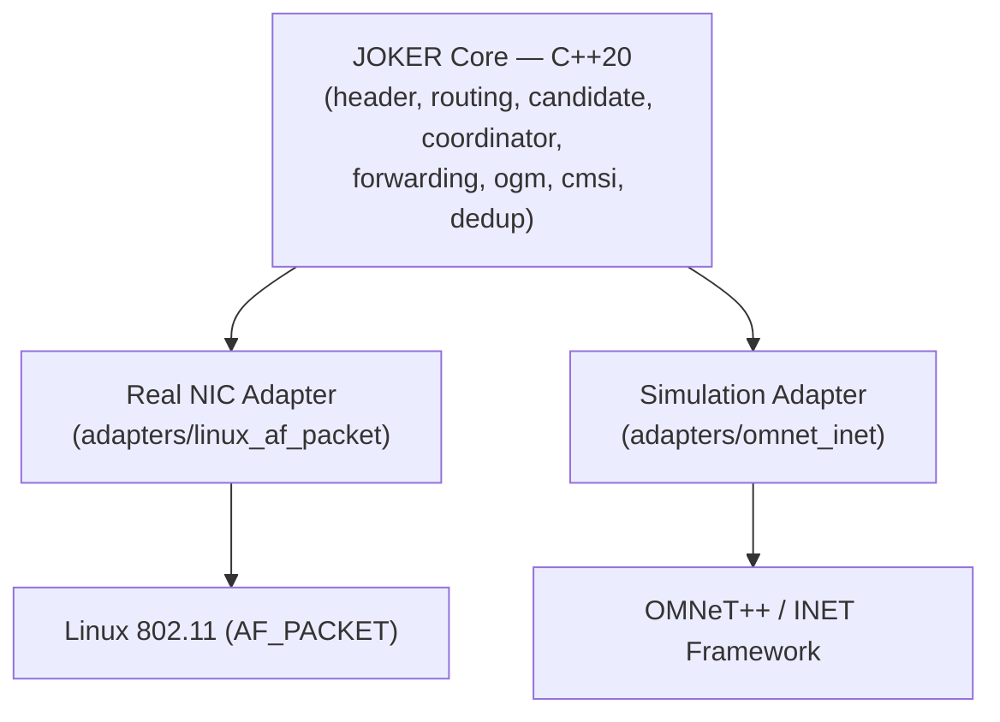

# JOKER — Implementation Guide

**Companion document:** `ARCHITECTURE.md` (read first — this document assumes its terminology, diagrams, and `[PAPER]/[DERIVED]/[ENGINEERING]/[OPTIONAL]` labeling scheme).

**Primary implementation language:** C++20 (chosen and held consistent throughout, per the recommended technology stack; Linux real-device adapter, Android NDK/JNI bridge, and OMNeT++/INET simulation adapter all wrap the same C++20 core).

**Audience:** an agentic coding IDE or human engineer implementing JOKER from scratch.

---

## 1. Recommended Project Structure

```text
joker/
├── include/
│   └── joker/
│       ├── protocol.hpp        # packet types, constants, protocol invariants
│       ├── packet.hpp          # packet buffer abstraction
│       ├── header.hpp          # JOKER header struct + serialize/deserialize
│       ├── mac_address.hpp     # MAC address type
│       ├── crc32.hpp           # packet-id CRC-32
│       ├── neighbor.hpp        # neighbor_table_t and entry type
│       ├── routing.hpp         # TQ / LQ / fade margin / distance penalty
│       ├── candidate.hpp       # candidate selection
│       ├── coordinator.hpp     # ACK + timer coordination interfaces
│       ├── timer_wheel.hpp     # timer coordination primitives
│       ├── ogm.hpp             # OGM build/send/receive/process
│       ├── cmsi.hpp            # CMSI calculation + scheduler
│       ├── dedup_cache.hpp     # bounded seen-packet cache
│       ├── forwarding.hpp      # central packet-processing pipeline
│       ├── metrics.hpp         # counters / gauges / histograms
│       ├── config.hpp          # joker_config_t
│       └── interface.hpp       # abstract NIC adapter interface
│
├── src/
│   ├── protocol.cpp
│   ├── packet.cpp
│   ├── header.cpp
│   ├── mac_address.cpp
│   ├── crc32.cpp
│   ├── neighbor.cpp
│   ├── routing.cpp
│   ├── candidate.cpp
│   ├── coordinator_ack.cpp
│   ├── coordinator_timer.cpp
│   ├── timer_wheel.cpp
│   ├── ogm.cpp
│   ├── cmsi.cpp
│   ├── dedup_cache.cpp
│   ├── forwarding.cpp
│   ├── metrics.cpp
│   ├── config.cpp
│   └── main.cpp                 # standalone Linux daemon entry point
│
├── adapters/
│   ├── linux_af_packet/         # AF_PACKET real-NIC adapter (isolated from core)
│   ├── android_jni/             # narrow JNI command/event bridge
│   └── omnet_inet/              # simulation adapter (module wrapping the core)
│
├── android/                     # Kotlin + Jetpack Compose application
├── python/                      # experimentation, analysis, Optuna tuning, Scapy tests
│
├── tests/
│   ├── unit/
│   ├── integration/
│   └── network/
│
├── tools/                       # CLI utilities (packet dumpers, config validators)
├── configs/                     # example YAML configs
├── docs/                        # ARCHITECTURE.md, IMPLEMENTATION.md live here
├── scripts/                     # build/test/CI helper scripts
├── CMakeLists.txt
└── README.md
```

**Module responsibility summary:**

- `protocol.hpp` — wire-format constants (header sizes, `TQmax = 255`, default TTL = 32, packet-type enum) marked `[PAPER]`, kept in one place so no magic numbers leak elsewhere.
- `header.hpp/.cpp` — **only** module allowed to know the byte layout of the JOKER header; all serialization/deserialization goes through explicit functions, never raw struct casts (see §4).
- `routing.hpp/.cpp` — TQ, fade margin, distance penalty, LQ — the paper's metric pipeline, isolated from candidate-selection policy.
- `candidate.hpp/.cpp` — sorting/selection policy built on top of `routing.hpp`.
- `coordinator_ack.cpp` / `coordinator_timer.cpp` — the two `[PAPER]` coordination schemes, implemented as separate strategy objects behind a common `Coordinator` interface so a node can be configured for either.
- `forwarding.cpp` — the single choke-point function `process_received_frame()` that ties classification → validation → dedup → routing decision → coordination → transmission together (§13).
- `adapters/*` — everything platform-specific; the core (`include/joker`, `src/`) must never `#include` anything from `adapters/`.

---

## 2. Configuration

```cpp
// include/joker/config.hpp
#pragma once
#include <cstdint>

namespace joker {

enum class CoordinationMode : uint8_t {
    kAckBased = 0,     // [PAPER]
    kTimerBased = 1,   // [PAPER]
};

struct Config {
    uint8_t  ttl_default        = 32;    // [PAPER] "usual figure of 32"
    uint16_t tq_max              = 255;   // [PAPER]
    uint8_t  candidate_count     = 2;     // [PAPER]-tunable; 2 is the experimentally
                                          // strongest default under heavy load
    CoordinationMode coordination = CoordinationMode::kTimerBased; // [ENGINEERING]
                                          // default choice; paper shows JOKER-timer
                                          // generally outperforming JOKER-ACK
    uint32_t twait_ms            = 50;    // [PAPER] best-tested value in the
                                          // paper's Nakagami-m video scenario;
                                          // NOT a universal optimum
    uint8_t  retry_limit         = 5;     // [PAPER]-tunable; paper's ablation
                                          // (Fig. 8) found 5 sufficient for
                                          // JOKER-timer to exceed 95% PDR
    uint32_t dedup_cache_capacity = 4096; // [ENGINEERING] — not paper-specified
    uint32_t dedup_cache_ttl_ms   = 5000; // [ENGINEERING]
    uint32_t neighbor_expiry_ms   = 6000; // [ENGINEERING], nominally a few CMSI
                                          // periods; not paper-specified
    double   cmsi_min_s           = 1.5;  // [PAPER] floor at TP=0
    double   cmsi_max_s           = 30.0; // [ENGINEERING] safety clamp, not
                                          // paper-specified
    double   sensitivity_dbm      = -74.0; // [PAPER] example value for the
                                           // BCM4330 chip used in the paper's
                                           // simulation; MUST be set to the
                                           // real deployed NIC's datasheet value
};

}  // namespace joker
```

**[ENGINEERING] configuration schema (YAML), paper-vs-recommended values:**

```yaml
joker:
  ttl: 32                     # [PAPER]
  candidate_count: 2          # [PAPER]-tunable, recommended default
  coordination: timer         # [PAPER]-tunable, recommended default: timer
  twait_ms: 50                # [PAPER] tested value, not universal
  retry_limit: 5              # [PAPER]-tunable, recommended default
  cmsi:
    enabled: true             # [PAPER] dynamic CMSI is core to the protocol
    min_seconds: 1.5          # [PAPER]
    max_seconds: 30.0         # [ENGINEERING] safety clamp
  dedup_cache:
    capacity: 4096            # [ENGINEERING]
    ttl_ms: 5000               # [ENGINEERING]
  neighbor:
    expiry_ms: 6000            # [ENGINEERING]
  interface:
    name: "wlan0"              # [ENGINEERING]
    sensitivity_dbm: -74.0     # [PAPER]-example, must match real hardware
```

### Defaults table

| Parameter | Paper value/default | Recommended implementation default | Reason |
|---|---:|---:|---|
| TTL | 32 | 32 | Paper |
| TQmax | 255 | 255 | Paper |
| Candidate count | configurable | 2 | Experimental evidence (best QoE/energy under heavy traffic in both ACK and timer modes) |
| Coordination | configurable | timer | Lower overhead, generally higher QoE in paper's results |
| twait | tested at 50 ms | 50 ms | Paper experiment (specific to its evaluated scenario) |
| Retry limit | configurable | 5 | Experimental result — JOKER-timer exceeds 95% PDR at retry_limit=5 |

**Do not present experimental optima as universal truths.** The paper found 50 ms effective for its evaluated timer-based scenario, while candidate-count behavior varied by traffic conditions (2 candidates best under heavy traffic; 3 candidates best under a single video stream). Any deployment with materially different topology, mobility, or traffic characteristics should re-tune these via the Python/Optuna experimentation layer rather than assume the paper's numbers transfer directly.

---

## 3. MAC Address Representation

```cpp
// include/joker/mac_address.hpp
#pragma once
#include <array>
#include <cstdint>
#include <string>
#include <string_view>
#include <optional>
#include <compare>

namespace joker {

class MacAddress {
public:
    static constexpr size_t kLength = 6;

    MacAddress() = default;
    explicit MacAddress(const std::array<uint8_t, kLength>& bytes) : bytes_(bytes) {}

    // Parses "aa:bb:cc:dd:ee:ff" (colon or dash separated). Returns nullopt on
    // any malformed input — never throws, never partially parses.
    static std::optional<MacAddress> Parse(std::string_view text);

    // Formats as lowercase colon-separated hex, always 17 chars.
    [[nodiscard]] std::string ToString() const;

    [[nodiscard]] const std::array<uint8_t, kLength>& bytes() const { return bytes_; }

    [[nodiscard]] bool IsBroadcast() const;   // ff:ff:ff:ff:ff:ff
    [[nodiscard]] bool IsZero() const;        // 00:00:00:00:00:00 — treated as invalid

    auto operator<=>(const MacAddress&) const = default;  // enables deterministic
                                                            // tie-break sort (§9 arch)
    bool operator==(const MacAddress&) const = default;

private:
    std::array<uint8_t, kLength> bytes_{};
};

// Hash support for use as unordered_map/unordered_set key (neighbor table,
// dedup cache keyed partially by MAC, etc.)
struct MacAddressHash {
    size_t operator()(const MacAddress& m) const noexcept;
};

}  // namespace joker
```

Implementation notes **[ENGINEERING]**:
- `Parse` must reject anything that is not exactly 6 hex-byte groups; never use `sscanf` without full return-value/length checking, to avoid partial-parse bugs.
- Copy is trivial (`std::array`), so `MacAddress` should be passed by value or `const&` — never by raw pointer.
- `operator<=>` gives the deterministic ascending-MAC tie-break used by candidate selection (§9 of `ARCHITECTURE.md`).

---

## 4. JOKER Header — Wire Format

**[PAPER]** Do not rely on compiler struct packing for the wire format. Always use explicit serialize/deserialize with defined byte order (network byte order / big-endian for multi-byte integer fields, consistent with standard networking convention — **[ENGINEERING]** choice, paper does not specify endianness).

```cpp
// include/joker/header.hpp
#pragma once
#include <cstdint>
#include <vector>
#include <optional>
#include "joker/mac_address.hpp"

namespace joker {

enum class PacketType : uint8_t {
    kUnicast    = 0,  // [PAPER] data packet
    kAck        = 1,  // [PAPER]
    kForwarding = 2,  // [PAPER]
    // Reserved range 3-255 for [OPTIONAL] extensions (e.g. authenticated OGM
    // variants). Never repurpose 0-2.
};

// [PAPER] Protocol invariant: fixed_overhead = 12 bytes; each additional
// candidate beyond the first adds 6 bytes.
// header_size(Ncandidates) = 12 + 6 * (Ncandidates - 1)
struct JokerHeader {
    PacketType   type;                 // 1 byte  [ENGINEERING resolution, see
                                        //          ARCHITECTURE.md §6 byte note]
    uint8_t      ttl;                  // 1 byte  [PAPER] default 32
    uint32_t     packet_id;            // 4 bytes [PAPER] CRC-32 of payload
    MacAddress   final_destination;    // 6 bytes [PAPER]
    // Candidates EXCLUDING the highest-priority one (that MAC travels in the
    // link-layer header instead — [PAPER]).
    std::vector<MacAddress> other_candidates;  // 6 bytes each [PAPER]

    [[nodiscard]] size_t WireSize() const {
        return 12 + 6 * other_candidates.size();
    }
};

// Serializes `header` into `out`, appending. Returns false if
// other_candidates.size() would overflow the configured max candidate count.
bool serialize_header(const JokerHeader& header, std::vector<uint8_t>& out);

// Parses a JokerHeader from `data` (starting at offset 0). On success,
// advances `consumed` to the number of bytes read and returns the header.
// On any malformed input (truncated buffer, invalid packet-type byte,
// candidate list larger than configured max) returns std::nullopt and
// consumes nothing — caller must drop the frame (never forward on parse
// failure, per ARCHITECTURE.md §13/§18).
std::optional<JokerHeader> deserialize_header(const std::vector<uint8_t>& data,
                                               size_t& consumed);

// Structural validation beyond parse success: rejects headers with TTL
// already 0 (should have been dropped upstream), duplicate candidate MACs,
// final_destination == broadcast/zero, or candidate count outside
// [0, kMaxCandidates - 1]. [ENGINEERING] — the paper does not specify
// validation logic; this exists purely to keep malformed input from ever
// reaching routing/forwarding logic.
bool validate_header(const JokerHeader& header, uint8_t max_candidates);

}  // namespace joker
```

```cpp
// src/header.cpp (excerpt — explicit byte-order handling)
#include "joker/header.hpp"

namespace joker {

namespace {
void put_u32_be(std::vector<uint8_t>& out, uint32_t v) {
    out.push_back(static_cast<uint8_t>((v >> 24) & 0xFF));
    out.push_back(static_cast<uint8_t>((v >> 16) & 0xFF));
    out.push_back(static_cast<uint8_t>((v >> 8) & 0xFF));
    out.push_back(static_cast<uint8_t>(v & 0xFF));
}

std::optional<uint32_t> get_u32_be(const std::vector<uint8_t>& data, size_t off) {
    if (off + 4 > data.size()) return std::nullopt;
    return (static_cast<uint32_t>(data[off]) << 24) |
           (static_cast<uint32_t>(data[off + 1]) << 16) |
           (static_cast<uint32_t>(data[off + 2]) << 8) |
            static_cast<uint32_t>(data[off + 3]);
}
}  // namespace

bool serialize_header(const JokerHeader& header, std::vector<uint8_t>& out) {
    out.push_back(static_cast<uint8_t>(header.type));
    out.push_back(header.ttl);
    put_u32_be(out, header.packet_id);
    out.insert(out.end(), header.final_destination.bytes().begin(),
                          header.final_destination.bytes().end());
    for (const auto& c : header.other_candidates) {
        out.insert(out.end(), c.bytes().begin(), c.bytes().end());
    }
    return true;
}

std::optional<JokerHeader> deserialize_header(const std::vector<uint8_t>& data,
                                               size_t& consumed) {
    constexpr size_t kFixedSize = 1 + 1 + 4 + 6;  // type + ttl + id + dest MAC
    if (data.size() < kFixedSize) return std::nullopt;

    JokerHeader h{};
    size_t off = 0;

    if (data[off] > static_cast<uint8_t>(PacketType::kForwarding))
        return std::nullopt;   // unknown packet type — reject, never forward
    h.type = static_cast<PacketType>(data[off]); off += 1;

    h.ttl = data[off]; off += 1;

    auto id = get_u32_be(data, off);
    if (!id) return std::nullopt;
    h.packet_id = *id; off += 4;

    std::array<uint8_t, 6> dest{};
    std::copy_n(data.begin() + off, 6, dest.begin());
    h.final_destination = MacAddress(dest);
    off += 6;

    // Remaining bytes must be an exact multiple of 6 (candidate MACs).
    size_t remaining = data.size() - off;
    if (remaining % 6 != 0) return std::nullopt;
    size_t n_extra = remaining / 6;
    h.other_candidates.reserve(n_extra);
    for (size_t i = 0; i < n_extra; ++i) {
        std::array<uint8_t, 6> mac{};
        std::copy_n(data.begin() + off, 6, mac.begin());
        h.other_candidates.emplace_back(mac);
        off += 6;
    }

    consumed = off;
    return h;
}

}  // namespace joker
```

**Alignment/portability note [ENGINEERING]:** because serialization is fully explicit (byte-by-byte push/copy, no `reinterpret_cast` of a packed struct onto the wire buffer), the implementation is immune to compiler padding differences, struct-packing pragmas, and endianness differences across platforms (x86 Linux vs. ARM Android). This is a deliberate departure from naive "cast a struct onto the wire" implementations, labeled **[ENGINEERING]** as a robustness improvement over what a literal 2016-era C implementation might have done, while producing byte-for-byte identical wire output to the paper's specified format.

---

## 5. CRC-32 Packet ID

**[PAPER]** The paper states the packet ID is obtained "by calculating the CRC-32 of the payload" but does not specify which CRC-32 variant/polynomial (there are several standardized CRC-32 variants, e.g. CRC-32/ISO-HDLC ("zlib"/Ethernet), CRC-32C (Castagnoli), etc.).

> **Gap note:** This is an unavoidable implementation choice the paper does not resolve. `IMPLEMENTATION.md` recommends the standard CRC-32/ISO-HDLC variant (the one used by zlib, PKZIP, Ethernet FCS, gzip) as the **[ENGINEERING]** default, because it is the most common meaning of "CRC-32" without further qualification and is what most implementers would reach for first in a from-scratch 2016-era C implementation. **This choice must be documented and versioned** — two JOKER nodes must agree on the exact CRC-32 variant or packet-ID-based deduplication will silently fail to recognize true duplicates (or worse, misidentify distinct packets as duplicates on collision).

```cpp
// include/joker/crc32.hpp
#pragma once
#include <cstdint>
#include <cstddef>

namespace joker {

// CRC-32/ISO-HDLC (polynomial 0xEDB88320, reflected, init 0xFFFFFFFF,
// final XOR 0xFFFFFFFF) — the "zlib"/Ethernet variant.
// [ENGINEERING] choice — see gap note above; NOT explicitly mandated by the
// paper's polynomial/variant (the paper does not specify one).
uint32_t crc32_iso_hdlc(const uint8_t* data, size_t length);

// joker_packet_id() is what candidate.cpp / forwarding.cpp actually call;
// it exists as a named seam so the CRC variant can be swapped in one place
// if interop testing against another implementation reveals a mismatch.
inline uint32_t joker_packet_id(const uint8_t* payload, size_t length) {
    return crc32_iso_hdlc(payload, length);
}

}  // namespace joker
```

```cpp
// src/crc32.cpp — table-based CRC-32/ISO-HDLC implementation
#include "joker/crc32.hpp"
#include <array>

namespace joker {

namespace {
constexpr std::array<uint32_t, 256> build_table() {
    std::array<uint32_t, 256> table{};
    for (uint32_t i = 0; i < 256; ++i) {
        uint32_t c = i;
        for (int k = 0; k < 8; ++k) {
            c = (c & 1) ? (0xEDB88320u ^ (c >> 1)) : (c >> 1);
        }
        table[i] = c;
    }
    return table;
}
constexpr std::array<uint32_t, 256> kTable = build_table();
}  // namespace

uint32_t crc32_iso_hdlc(const uint8_t* data, size_t length) {
    uint32_t crc = 0xFFFFFFFFu;
    for (size_t i = 0; i < length; ++i) {
        crc = kTable[(crc ^ data[i]) & 0xFF] ^ (crc >> 8);
    }
    return crc ^ 0xFFFFFFFFu;
}

}  // namespace joker
```

---

## 6. Neighbor Table

```cpp
// include/joker/neighbor.hpp
#pragma once
#include <chrono>
#include <optional>
#include <unordered_map>
#include "joker/mac_address.hpp"

namespace joker {

struct NeighborEntry {
    MacAddress mac;                         // [PAPER] neighbor identity
    std::chrono::steady_clock::time_point last_seen;  // [ENGINEERING]

    // Metric inputs [PAPER]
    uint8_t  tq_local   = 0;    // TQlocal toward this neighbor
    uint8_t  tq_recv    = 0;    // TQrecv as reported by neighbor via OGM
    double   f_asym     = 1.0;  // asymmetry factor (BATMAN-inherited, [DERIVED])
    double   hop_penalty = 1.0; // hop-count penalty (BATMAN-inherited, [DERIVED])

    double   rx_power_dbm = 0.0;  // [PAPER] most recent received power
                                   // (for fade margin calculation)

    bool     reachable_to_dest = false;  // [DERIVED] — whether this neighbor
                                          // has a known route toward a given
                                          // destination; in a full
                                          // implementation this is
                                          // per-(neighbor,destination), not a
                                          // single bool — see note below

    [[nodiscard]] bool IsStale(std::chrono::steady_clock::time_point now,
                                std::chrono::milliseconds expiry) const {
        return (now - last_seen) > expiry;   // [ENGINEERING]
    }
};

// [DERIVED] note: BATMAN-style routing state is naturally keyed by
// (originator/destination) with a chosen best link-local neighbor per
// destination, not a flat neighbor list. The simplified NeighborEntry above
// suffices for single-hop link quality; §candidate.hpp composes per-
// destination reachability by consulting OGM-derived route entries keyed by
// (destination, via_neighbor). See ogm.hpp's RouteEntry.

class NeighborTable {
public:
    void Update(const NeighborEntry& fresh);                       // [PAPER]-driven,
                                                                      // called on OGM RX
    void ExpireStale(std::chrono::steady_clock::time_point now,
                      std::chrono::milliseconds expiry);             // [ENGINEERING]
    [[nodiscard]] std::optional<NeighborEntry> Lookup(const MacAddress& mac) const;
    [[nodiscard]] std::vector<NeighborEntry> AllFresh(
        std::chrono::steady_clock::time_point now,
        std::chrono::milliseconds expiry) const;                     // used by
                                                                        // candidate
                                                                        // selection

private:
    std::unordered_map<MacAddress, NeighborEntry, MacAddressHash> table_;
};

}  // namespace joker
```

`neighbor_update()` / `neighbor_expire()` / `neighbor_lookup()` map directly onto `NeighborTable::Update` / `ExpireStale` / `Lookup` above.

---

## 7. OGM Generation

```cpp
// include/joker/ogm.hpp
#pragma once
#include <cstdint>
#include <optional>
#include "joker/mac_address.hpp"
#include "joker/neighbor.hpp"

namespace joker {

// [ENGINEERING/DERIVED] wire format: the paper describes OGM's role and
// origin (BATMAN-inherited "tiny packet") but does not give a byte-level
// OGM layout. This struct is a documented, versioned engineering proposal,
// not a paper-mandated format. It carries the minimum fields JOKER's TQ/LQ
// pipeline needs, modeled on BATMAN's OGM fields.
struct Ogm {
    MacAddress originator;      // [DERIVED] node this OGM describes
    uint32_t   sequence_number; // [DERIVED] BATMAN-style, for freshness/loop
                                  // avoidance
    uint8_t    tq_reported;     // [DERIVED] TQ as computed by the sender
                                  // toward `originator` (propagates TQrecv to
                                  // the next hop)
    uint8_t    ttl;              // [DERIVED] bounds OGM flood radius,
                                  // analogous to BATMAN OGM TTL
};

// Builds this node's own OGM (originator == self).
Ogm ogm_build(const MacAddress& self_mac, uint32_t next_sequence_number,
              uint8_t initial_ttl);

// Broadcasts an OGM via the NIC adapter (link-layer broadcast address).
void ogm_send(const Ogm& ogm /*, NicAdapter& nic */);

// Called on receipt of a (possibly relayed) OGM frame.
std::optional<Ogm> ogm_receive(const std::vector<uint8_t>& raw_frame);

// Updates neighbor/routing state from a received OGM, and decides whether
// to selectively rebroadcast it (BATMAN-inherited flooding-with-suppression
// logic [DERIVED] — exact rebroadcast selection algorithm is BATMAN's, not
// restated by the JOKER paper, and must be treated as inherited rather than
// reinvented).
void ogm_process(const Ogm& ogm, NeighborTable& neighbors,
                  double rx_power_dbm);

}  // namespace joker
```

**Explanation of how OGM information updates routing state [DERIVED]:** each received OGM updates the reporting neighbor's `tq_recv` field (their self-reported TQ toward the OGM's originator), while the local link's `tq_local` is measured independently (e.g., from OGM reception statistics over that link, BATMAN-style). Combined via Eq. (1), this produces the end-to-end TQ toward `originator` via that neighbor. `ogm_process` is the single place these two contributions are fused into `NeighborTable` entries.

---

## 8. TQ Calculation

```cpp
// include/joker/routing.hpp
#pragma once
#include <cstdint>
#include "joker/neighbor.hpp"

namespace joker {

// [PAPER] Eq. (1): TQ = TQlocal * TQrecv * fasym * hop_penalty
// All inputs and the output are on the BATMAN 0..TQmax scale except
// fasym/hop_penalty which are dimensionless multipliers in [0,1].
uint8_t calculate_tq(uint8_t tq_local, uint8_t tq_recv,
                      double f_asym, double hop_penalty, uint16_t tq_max);

}  // namespace joker
```

```cpp
// src/routing.cpp (excerpt)
#include "joker/routing.hpp"
#include <algorithm>
#include <cmath>

namespace joker {

uint8_t calculate_tq(uint8_t tq_local, uint8_t tq_recv,
                      double f_asym, double hop_penalty, uint16_t tq_max) {
    // Normalize to [0,1], multiply, rescale to [0, tq_max], clamp, round.
    const double local_n = static_cast<double>(tq_local) / tq_max;
    const double recv_n  = static_cast<double>(tq_recv)  / tq_max;
    double tq = local_n * recv_n * f_asym * hop_penalty * tq_max;
    tq = std::clamp(tq, 0.0, static_cast<double>(tq_max));
    return static_cast<uint8_t>(std::lround(tq));
}

}  // namespace joker
```

**[PAPER]** faithfully implements Eq. (1). `f_asym` and `hop_penalty` themselves are **[DERIVED]** — inherited conceptually from BATMAN, not re-specified by the JOKER paper; a from-scratch implementation must port BATMAN's asymmetry and hop-penalty computation (e.g., ratio of OGMs successfully echoed back vs. received, and a per-hop multiplicative decay) rather than invent a new formula.

---

## 9. Fade Margin

```cpp
// include/joker/routing.hpp (continued)
namespace joker {

// [PAPER] FM = received power − sensitivity, both in dBm.
double calculate_fade_margin(double received_power_dbm, double sensitivity_dbm);

}  // namespace joker
```

```cpp
double calculate_fade_margin(double received_power_dbm, double sensitivity_dbm) {
    return received_power_dbm - sensitivity_dbm;   // [PAPER]
}
```

`sensitivity_dbm` must be sourced from the actual deployed wireless card's datasheet (**[ENGINEERING]**, configuration-driven — see `Config::sensitivity_dbm`); the paper's own simulation used −74 dBm for the Broadcom BCM4330 at 54 Mbps, which is an example value tied to that specific chipset, not a universal constant.

---

## 10. Distance Penalty

```cpp
// include/joker/routing.hpp (continued)
namespace joker {

// [PAPER] Table I mapping. No hidden constants — thresholds and penalty
// values below are exactly the paper's.
inline uint8_t distance_penalty(double fade_margin_db) {
    if (fade_margin_db < 10.0) return 1;                         // [PAPER]
    if (fade_margin_db <= 20.0) return 3;                        // [PAPER]
    return 5;                                                     // [PAPER]
}

}  // namespace joker
```

---

## 11. JOKER LQ Calculation

```cpp
// include/joker/routing.hpp (continued)
namespace joker {

// [PAPER] Eq. (2): LQ = TQ * (TQmax - Distance_penalty) / TQmax
double calculate_joker_lq(uint8_t tq, uint8_t distance_penalty_value,
                           uint16_t tq_max);

}  // namespace joker
```

```cpp
double calculate_joker_lq(uint8_t tq, uint8_t distance_penalty_value,
                           uint16_t tq_max) {
    if (tq_max == 0) return 0.0;   // [ENGINEERING] guard against div-by-zero;
                                     // tq_max is configuration-controlled and
                                     // should never legitimately be 0
    const double numerator = static_cast<double>(tq_max) -
                              static_cast<double>(distance_penalty_value);
    double lq = static_cast<double>(tq) * numerator / static_cast<double>(tq_max);
    // [ENGINEERING] numeric-range handling: distance_penalty_value in {1,3,5}
    // is always << tq_max (255 by default), so numerator stays positive; the
    // clamp below is a defensive guard, not something the paper's numbers
    // would normally trigger.
    return std::clamp(lq, 0.0, static_cast<double>(tq_max));
}
```

---

## 12. Candidate Selection

```cpp
// include/joker/candidate.hpp
#pragma once
#include <vector>
#include "joker/mac_address.hpp"
#include "joker/neighbor.hpp"

namespace joker {

struct Candidate {
    MacAddress mac;
    double     lq;
    uint8_t    priority;   // 1 = highest [PAPER]
};

// [PAPER]/[DERIVED] — see ARCHITECTURE.md §9 for full algorithm narrative.
// Deterministic: given the same neighbor_table snapshot, always produces the
// same ordered candidate list (ties broken by ascending MAC — [ENGINEERING]).
std::vector<Candidate> select_candidates(
    const MacAddress& destination,
    const NeighborTable& neighbor_table,
    uint8_t candidate_count,
    const Config& config);

}  // namespace joker
```

```cpp
// src/candidate.cpp
#include "joker/candidate.hpp"
#include "joker/routing.hpp"
#include <algorithm>
#include <chrono>

namespace joker {

std::vector<Candidate> select_candidates(
    const MacAddress& destination,
    const NeighborTable& neighbor_table,
    uint8_t candidate_count,
    const Config& config) {

    auto now = std::chrono::steady_clock::now();
    auto expiry = std::chrono::milliseconds(config.neighbor_expiry_ms);

    auto fresh = neighbor_table.AllFresh(now, expiry);   // [ENGINEERING] excludes
                                                            // stale neighbors

    std::vector<Candidate> scored;
    scored.reserve(fresh.size());
    for (const auto& n : fresh) {
        if (!n.reachable_to_dest) continue;   // [DERIVED] eligibility predicate
                                                 // — must have a known route
                                                 // toward `destination`
        // NOTE: in a full implementation, reachable_to_dest and tq_recv are
        // looked up per (neighbor, destination) via OGM-derived route state,
        // not a single flat NeighborEntry — simplified here for clarity.
        uint8_t tq = calculate_tq(n.tq_local, n.tq_recv, n.f_asym,
                                    n.hop_penalty, config.tq_max);
        double fm = calculate_fade_margin(n.rx_power_dbm, config.sensitivity_dbm);
        uint8_t dp = distance_penalty(fm);
        double lq = calculate_joker_lq(tq, dp, config.tq_max);

        scored.push_back(Candidate{n.mac, lq, 0});
    }

    // [PAPER] sort descending by LQ; [ENGINEERING] tie-break ascending MAC
    std::sort(scored.begin(), scored.end(), [](const Candidate& a, const Candidate& b) {
        if (a.lq != b.lq) return a.lq > b.lq;
        return a.mac < b.mac;
    });

    if (scored.size() > candidate_count) {
        scored.resize(candidate_count);   // [PAPER] top Ncandidates
    }

    for (size_t i = 0; i < scored.size(); ++i) {
        scored[i].priority = static_cast<uint8_t>(i + 1);   // [PAPER] 1 = highest
    }

    return scored;
}

}  // namespace joker
```

**Complexity:** O(E log E) as documented in `ARCHITECTURE.md` §9; for large neighbor counts, replace `std::sort` with `std::partial_sort(scored.begin(), scored.begin() + candidate_count, scored.end(), ...)` for O(E + k log k).

---

## 13. Packet Processing Pipeline

This is the most important code template — the single choke-point that every received frame passes through.

```cpp
// include/joker/forwarding.hpp
#pragma once
#include <vector>
#include <cstdint>
#include "joker/header.hpp"
#include "joker/neighbor.hpp"
#include "joker/dedup_cache.hpp"
#include "joker/config.hpp"

namespace joker {

class NicAdapter;      // abstract TX/RX interface, implemented in adapters/
class Coordinator;     // ACK or Timer coordinator, selected by config
class Metrics;

// process_received_frame(): the central RX decision pipeline.
// Called by the adapter for every frame delivered by the NIC (promiscuous
// mode means this includes frames not addressed to this node's MAC).
void process_received_frame(
    const std::vector<uint8_t>& raw_frame,
    const MacAddress& local_mac,
    NeighborTable& neighbors,
    DedupCache& dedup,
    Coordinator& coordinator,
    NicAdapter& nic,
    Metrics& metrics,
    const Config& config);

}  // namespace joker
```

```cpp
// src/forwarding.cpp
#include "joker/forwarding.hpp"
#include "joker/candidate.hpp"
#include "joker/interface.hpp"
#include "joker/coordinator.hpp"
#include "joker/metrics.hpp"

namespace joker {

void process_received_frame(
    const std::vector<uint8_t>& raw_frame,
    const MacAddress& local_mac,
    NeighborTable& neighbors,
    DedupCache& dedup,
    Coordinator& coordinator,
    NicAdapter& nic,
    Metrics& metrics,
    const Config& config) {

    metrics.Increment("packets_received");

    // 1. Strip link-layer header, isolate JOKER payload region.
    //    [ENGINEERING] — adapter-specific; assume `raw_frame` here is already
    //    the JOKER-header-onward slice for clarity.
    size_t consumed = 0;
    auto header_opt = deserialize_header(raw_frame, consumed);
    if (!header_opt) {
        metrics.Increment("packets_dropped");
        metrics.Increment("malformed_header");
        return;   // [ENGINEERING] never forward on parse failure
    }
    JokerHeader header = *header_opt;

    // 2. Structural validation.
    if (!validate_header(header, config.candidate_count)) {
        metrics.Increment("packets_dropped");
        metrics.Increment("invalid_header");
        return;   // [ENGINEERING]
    }

    // 3. Packet-type dispatch. [PAPER] three data-plane types + OGM handled
    //    upstream by a separate control-plane path (not shown here).
    switch (header.type) {
        case PacketType::kAck:
            coordinator.HandleAck(header, raw_frame, consumed);   // [PAPER]
            return;
        case PacketType::kForwarding:
            coordinator.HandleForwardingMessage(header, raw_frame, consumed); // [PAPER]
            return;
        case PacketType::kUnicast:
            break;  // fall through to data-packet handling below
    }

    // 4. Lucky long transmission check — BEFORE dedup/candidate logic,
    //    since the paper treats destination acceptance as immediate and
    //    unconditional on forwarding role. [PAPER]
    if (header.final_destination == local_mac) {
        // Even if this node was never an intended candidate for this hop.
        if (dedup.Contains(header.packet_id)) {
            metrics.Increment("duplicates");
            return;   // [ENGINEERING] avoid double-delivery to upper layers
        }
        dedup.Insert(header.packet_id);
        metrics.Increment("packets_delivered_lucky_or_direct");
        // deliver_to_network_layer(raw_frame, consumed);  // [ENGINEERING] hook
        return;
    }

    // 5. TTL check. [PAPER]
    if (header.ttl == 0) {
        metrics.Increment("ttl_expired");
        metrics.Increment("packets_dropped");
        return;   // never forward a TTL=0 packet — protocol invariant
    }

    // 6. Duplicate suppression. [ENGINEERING], mitigating a [PAPER]-
    //    acknowledged phenomenon (esp. under timer-based coordination).
    if (dedup.Contains(header.packet_id)) {
        metrics.Increment("duplicates");
        return;
    }
    dedup.Insert(header.packet_id);

    // 7. Not destination, not lucky — this node is (at most) a candidate.
    //    Is local_mac actually one of the intended candidates (top-priority
    //    in link-layer header, or listed in header.other_candidates)?
    //    [ENGINEERING] — must be checked by the adapter layer using the
    //    link-layer destination field; assume `is_candidate` is passed in
    //    or derivable here.
    bool is_candidate = /* adapter-supplied: local_mac was the link-layer
                            unicast target, OR appears in
                            header.other_candidates */ true;
    if (!is_candidate) {
        // Overheard but not relevant — used only for passive link-quality
        // observation, not forwarding. [DERIVED]
        return;
    }

    metrics.Increment("candidate_packets_received");

    // 8. Hand off to the configured coordination scheme. TTL decrement
    //    happens at the point of actual re-transmission (see TTL Handling
    //    template below), not here — [ENGINEERING] resolution of an
    //    ambiguity the paper does not spell out explicitly.
    coordinator.OnCandidateReceivedDataPacket(header, raw_frame, consumed,
                                                local_mac, neighbors, nic, metrics,
                                                config);
}

}  // namespace joker
```

---

## 14. ACK Coordinator

```cpp
// include/joker/coordinator.hpp
#pragma once
#include <unordered_map>
#include <chrono>
#include "joker/header.hpp"
#include "joker/mac_address.hpp"

namespace joker {

class Coordinator {
public:
    virtual ~Coordinator() = default;
    virtual void OnCandidateReceivedDataPacket(
        const JokerHeader& header, const std::vector<uint8_t>& frame,
        size_t header_offset, const MacAddress& local_mac,
        NeighborTable& neighbors, NicAdapter& nic, Metrics& metrics,
        const Config& config) = 0;
    virtual void HandleAck(const JokerHeader& header,
                            const std::vector<uint8_t>& frame, size_t offset) = 0;
    virtual void HandleForwardingMessage(const JokerHeader& header,
                                          const std::vector<uint8_t>& frame,
                                          size_t offset) = 0;
};

// [PAPER] ACK-based coordination (§III-C, Fig. 2(a))
class AckCoordinator final : public Coordinator {
public:
    void OnCandidateReceivedDataPacket(
        const JokerHeader& header, const std::vector<uint8_t>& frame,
        size_t header_offset, const MacAddress& local_mac,
        NeighborTable& neighbors, NicAdapter& nic, Metrics& metrics,
        const Config& config) override;

    void HandleAck(const JokerHeader& header,
                    const std::vector<uint8_t>& frame, size_t offset) override;

    void HandleForwardingMessage(const JokerHeader& header,
                                  const std::vector<uint8_t>& frame,
                                  size_t offset) override;

private:
    struct PendingCoordination {
        uint32_t packet_id;
        std::vector<uint8_t> original_frame;   // retained for later forward-on-select
        std::chrono::steady_clock::time_point deadline;   // [ENGINEERING] timeout,
                                                              // not paper-specified
        std::optional<MacAddress> first_ack_sender;
    };
    // Keyed by packet_id — the TX side's view of packets awaiting coordination.
    std::unordered_map<uint32_t, PendingCoordination> pending_;
};

}  // namespace joker
```

```cpp
// src/coordinator_ack.cpp (excerpt — the TX-side and candidate-side halves)
#include "joker/coordinator.hpp"
#include "joker/interface.hpp"
#include "joker/metrics.hpp"

namespace joker {

// Candidate side: receiving a DATA packet under ACK-based coordination.
// [PAPER] "once the packet is received, the ACK message is generated and
// sent" — no priority-based delay.
void AckCoordinator::OnCandidateReceivedDataPacket(
    const JokerHeader& header, const std::vector<uint8_t>& /*frame*/,
    size_t /*header_offset*/, const MacAddress& local_mac,
    NeighborTable& /*neighbors*/, NicAdapter& nic, Metrics& metrics,
    const Config& /*config*/) {

    // Build and send an ACK: packet-id only, NO candidate list. [PAPER]
    JokerHeader ack{};
    ack.type = PacketType::kAck;
    ack.ttl = 1;                          // control packet, single hop
    ack.packet_id = header.packet_id;
    ack.final_destination = local_mac;    // sender identity carried implicitly
                                            // via link-layer source address in
                                            // most designs; included here for
                                            // clarity of correlation
    std::vector<uint8_t> wire;
    serialize_header(ack, wire);
    nic.TransmitUnicast(/* to = previous hop's MAC, adapter-supplied */ {}, wire);
    metrics.Increment("ack_sent");
}

// TX side: correlate an incoming ACK with a pending coordination, act only
// on the FIRST one received. [PAPER] "there is no distinction among
// candidates... once the packet is received, the ACK message is generated
// and sent" — coordination is resolved by arrival order at the TX.
void AckCoordinator::HandleAck(const JokerHeader& header,
                                 const std::vector<uint8_t>& /*frame*/,
                                 size_t /*offset*/) {
    auto it = pending_.find(header.packet_id);
    if (it == pending_.end()) return;   // [ENGINEERING] stale/unknown ACK,
                                          // e.g. arrived after timeout — ignore

    if (it->second.first_ack_sender.has_value()) {
        return;   // already resolved; ignore subsequent ACKs [PAPER]-implied
                   // (only the first matters)
    }
    it->second.first_ack_sender = /* adapter-supplied source MAC of this ACK */
                                    MacAddress{};

    // Send Forwarding message ONLY to the sender of the first ACK. [PAPER]
    JokerHeader fwd{};
    fwd.type = PacketType::kForwarding;
    fwd.ttl = 1;
    fwd.packet_id = header.packet_id;
    fwd.final_destination = *it->second.first_ack_sender;
    std::vector<uint8_t> wire;
    serialize_header(fwd, wire);
    // nic.TransmitUnicast(*it->second.first_ack_sender, wire);   // [ENGINEERING]
    // metrics.Increment("forwarding_messages");
    pending_.erase(it);   // coordination resolved
}

// Candidate side: receiving the Forwarding message means THIS node was
// selected; it must now actually forward the original data packet. [PAPER]
void AckCoordinator::HandleForwardingMessage(const JokerHeader& header,
                                               const std::vector<uint8_t>& /*frame*/,
                                               size_t /*offset*/) {
    // Look up the retained original frame for header.packet_id and forward
    // it (TTL already validated/decremented at receipt time or here —
    // [ENGINEERING] resolution, see TTL Handling template).
    // nic.TransmitUnicast(next_hop_top_candidate, retained_frame);
    // metrics.Increment("timer_forwards"); // (reuse general forward counter)
}

}  // namespace joker
```

**Timeout handling [ENGINEERING]:** `PendingCoordination::deadline` and its expiry sweep are not specified by the paper. Recommended: a bounded wait (configurable, e.g. a small multiple of expected RTT) after which, if no ACK arrived, the TX either retries transmission (consuming one unit of `retry_limit`) or drops the packet if `retry_limit` is exhausted — this directly implements the paper's general "retransmissions" tunable for the specific case of ACK-based coordination.

---

## 15. Timer Coordinator

```cpp
// include/joker/timer_wheel.hpp — minimal timer primitive used by the
// timer-based coordinator. [ENGINEERING] — the paper describes the
// wait-and-listen behavior, not a concrete timer data structure.
#pragma once
#include <cstdint>
#include <functional>
#include <chrono>

namespace joker {

using TimerId = uint64_t;

class TimerWheel {
public:
    // Schedules `callback` to fire after `delay`; returns an id usable for
    // cancellation. Must be safe to cancel from within a callback (no
    // reentrancy deadlocks) and must not double-fire a cancelled timer that
    // races with expiry (ARCHITECTURE.md §15).
    TimerId Schedule(std::chrono::milliseconds delay,
                      std::function<void()> callback);
    void Cancel(TimerId id);
    void Tick();   // called by the event loop
};

}  // namespace joker
```

```cpp
// include/joker/coordinator.hpp (continued)
namespace joker {

// [PAPER] Timer-based coordination (§III-C, Fig. 2(b))
class TimerCoordinator final : public Coordinator {
public:
    explicit TimerCoordinator(TimerWheel& wheel) : wheel_(wheel) {}

    void OnCandidateReceivedDataPacket(
        const JokerHeader& header, const std::vector<uint8_t>& frame,
        size_t header_offset, const MacAddress& local_mac,
        NeighborTable& neighbors, NicAdapter& nic, Metrics& metrics,
        const Config& config) override;

    // No ACK/Forwarding messages exist in timer mode — these are no-ops,
    // but overheard forwards of a DATA packet must be observed via a
    // separate passive-overhear hook, not via HandleAck/HandleForwardingMessage.
    void HandleAck(const JokerHeader&, const std::vector<uint8_t>&, size_t) override {}
    void HandleForwardingMessage(const JokerHeader&, const std::vector<uint8_t>&,
                                  size_t) override {}

    // Called by forwarding.cpp when a DATA packet's re-transmission (by
    // some other candidate) is overheard, keyed by packet_id.
    void HandleOverheardForward(uint32_t packet_id);

private:
    struct PendingForward {
        TimerId timer_id;
        std::vector<uint8_t> frame;  // retained for eventual forward
    };
    std::unordered_map<uint32_t, PendingForward> pending_;
    TimerWheel& wheel_;
};

}  // namespace joker
```

```cpp
// src/coordinator_timer.cpp
#include "joker/coordinator.hpp"
#include "joker/interface.hpp"
#include "joker/metrics.hpp"

namespace joker {

void start_forward_timer(TimerWheel& wheel,
                          std::unordered_map<uint32_t, TimerCoordinator::PendingForward>& pending,
                          const JokerHeader& header,
                          const std::vector<uint8_t>& frame,
                          uint8_t local_priority,     // this candidate's own
                                                        // priority in the list
                          uint32_t twait_ms,
                          std::function<void()> on_expiry) {
    // [PAPER] wait = twait * (priority - 1)
    auto delay = std::chrono::milliseconds(
        static_cast<uint32_t>(twait_ms) * (local_priority - 1));

    TimerId id = wheel.Schedule(delay, std::move(on_expiry));
    pending[header.packet_id] = {id, frame};
}

void TimerCoordinator::OnCandidateReceivedDataPacket(
    const JokerHeader& header, const std::vector<uint8_t>& frame,
    size_t /*header_offset*/, const MacAddress& /*local_mac*/,
    NeighborTable& /*neighbors*/, NicAdapter& nic, Metrics& metrics,
    const Config& config) {

    // local_priority must be resolved by the caller (this candidate's own
    // position in the candidate list for this packet, either 1 [top,
    // link-layer-addressed] or looked up in header.other_candidates).
    uint8_t local_priority = /* adapter/context-supplied */ 1;

    start_forward_timer(wheel_, pending_, header, frame, local_priority,
        config.twait_ms,
        [this, packet_id = header.packet_id, &nic, &metrics]() {
            handle_forward_timer_expiry(packet_id, nic, metrics);
        });
}

// [PAPER] "If no other previous packet-relaying is heard" at expiry, forward.
void handle_forward_timer_expiry(uint32_t /*packet_id*/, NicAdapter& /*nic*/,
                                   Metrics& metrics) {
    // Look up pending_[packet_id].frame, TTL-decrement (see §TTL below),
    // re-serialize destination as the next hop's top candidate, and
    // transmit. Remove from pending_ afterward.
    metrics.Increment("timer_forwards");
}

// [PAPER] "if a lower priority candidate does not hear the transmission of
// a higher priority candidate, duplicated packets can appear" — this hook
// is how a candidate suppresses itself when it DOES hear it.
void TimerCoordinator::HandleOverheardForward(uint32_t packet_id) {
    auto it = pending_.find(packet_id);
    if (it == pending_.end()) return;   // not something we were waiting on
    wheel_.Cancel(it->second.timer_id);  // [PAPER] suppress own forwarding
    pending_.erase(it);
    // metrics.Increment("timer_suppressions");  // requires metrics ref threaded in
}

}  // namespace joker
```

**Duplicate suppression note [PAPER]/[ENGINEERING]:** `HandleOverheardForward` implements the paper's suppression rule directly. The residual duplicate-forwarding case the paper acknowledges (a lower-priority candidate that fails to overhear) is *not* prevented here — it is caught downstream at the **next** hop by `dedup_cache` (§16), which is the paper-consistent mitigation: JOKER tolerates occasional duplicates rather than trying to make suppression perfect.

---

## 16. Packet Deduplication

```cpp
// include/joker/dedup_cache.hpp
#pragma once
#include <cstdint>
#include <chrono>
#include <unordered_map>
#include <list>

namespace joker {

// [ENGINEERING] Bounded, TTL-evicting cache of recently-seen packet IDs.
// An unbounded cache is unacceptable: under sustained traffic or a
// duplicate-flooding attack (see ARCHITECTURE.md §17 Security), memory
// would grow without limit. This uses an LRU list + hash map for O(1)
// insert/lookup/evict.
class DedupCache {
public:
    explicit DedupCache(size_t capacity, std::chrono::milliseconds ttl)
        : capacity_(capacity), ttl_(ttl) {}

    [[nodiscard]] bool Contains(uint32_t packet_id) const;
    void Insert(uint32_t packet_id);
    void EvictExpired(std::chrono::steady_clock::time_point now);   // periodic sweep

private:
    struct Entry {
        uint32_t packet_id;
        std::chrono::steady_clock::time_point inserted_at;
    };
    size_t capacity_;
    std::chrono::milliseconds ttl_;
    std::list<Entry> lru_order_;
    std::unordered_map<uint32_t, std::list<Entry>::iterator> index_;
    // On Insert(): if index_.size() >= capacity_, evict oldest (front of
    // lru_order_) regardless of TTL, guaranteeing the bounded-memory
    // invariant holds even under adversarial packet-id diversity.
};

}  // namespace joker
```

Why bounded capacity **and** TTL: TTL alone does not bound worst-case memory if an attacker (or a pathological burst) inserts entries faster than they expire; a hard capacity cap with LRU eviction is the actual memory-safety guarantee, TTL is a correctness/freshness aid on top of it.

---

## 17. Lucky Long Transmission — explicit logic

Already shown inline in `process_received_frame()` (§13, step 4). Restated as an isolated helper for clarity/testability:

```cpp
// [PAPER] Recognizing and accepting a lucky long transmission.
bool is_lucky_long_or_direct_delivery(const JokerHeader& header,
                                        const MacAddress& local_mac) {
    return header.final_destination == local_mac;
    // No further condition — [PAPER] explicitly states this acceptance is
    // unconditional on whether local_mac was an intended candidate for this
    // specific hop.
}
```

---

## 18. TTL Handling

```cpp
// [PAPER] semantics, [ENGINEERING] resolution of WHEN decrement happens.
//
// The paper states TTL is "the number of hops that it is permitted to
// travel before being discarded," decremented per hop, dropped at 0. It
// does NOT specify whether decrement happens at receive time or at the
// point of re-transmission. This implementation decrements at the point of
// ACTUAL re-transmission (i.e., when a candidate has been elected forwarder
// and is about to send), not at every candidate's mere reception — because
// multiple candidates may receive the same packet without all of them
// forwarding it, and decrementing per-reception (rather than per-hop) would
// make TTL accounting depend on candidate-set size, which is not the
// paper's stated semantics ("number of hops," i.e., actual forwarding
// events).
if (header.ttl == 0) {
    drop_packet();
} else {
    header.ttl -= 1;
    // ... proceed to actually transmit as the elected forwarder
}
```

This decision is labeled **[ENGINEERING]** (interpretation of an underspecified point) and must not be silently changed without updating this note and re-validating hop-count experiments against Table V of the paper.

---

## 19. CMSI Scheduler

```cpp
// include/joker/cmsi.hpp
#pragma once

namespace joker {

// [PAPER] Eq. (3): CMSI = 0.006 * TP + 1.5, TP in kbps.
double calculate_cmsi(double throughput_kbps);

class CmsiScheduler {
public:
    CmsiScheduler(TimerWheel& wheel, double min_s, double max_s)
        : wheel_(wheel), min_s_(min_s), max_s_(max_s) {}

    // Called once at startup and again from each OGM-broadcast callback to
    // reschedule based on the freshest throughput measurement.
    void Reschedule(double throughput_kbps, std::function<void()> on_fire);

private:
    TimerWheel& wheel_;
    double min_s_;
    double max_s_;   // [ENGINEERING] safety clamp, not paper-specified
};

}  // namespace joker
```

```cpp
double calculate_cmsi(double throughput_kbps) {
    return 0.006 * throughput_kbps + 1.5;   // [PAPER] Eq. 3
}

void CmsiScheduler::Reschedule(double throughput_kbps,
                                 std::function<void()> on_fire) {
    double interval_s = calculate_cmsi(throughput_kbps);
    interval_s = std::clamp(interval_s, min_s_, max_s_);   // [ENGINEERING]
    auto delay = std::chrono::milliseconds(
        static_cast<int64_t>(interval_s * 1000));
    wheel_.Schedule(delay, std::move(on_fire));
}
```

---

## 20. Network Interface Implementation

**[PAPER]** states only that the real implementation was written in C, tested on Ubuntu 12.04 (kernel 3.2.0), and that the wireless card must run in promiscuous mode. It does **not** mandate a specific Linux packet API — that is an implementation choice.

| Option | Prototype | Research experimentation | Production-like |
|---|---|---|---|
| **AF_PACKET (raw sockets)** | Good | **Best fit** — low-level, precise control, matches paper's link/network-boundary framing | Good, requires careful privilege handling (`CAP_NET_RAW`) |
| **libpcap** | Good, fast to prototype | Good for RX-only tooling (e.g., packet dumpers), less natural for full duplex JOKER TX/RX | Adds a dependency layer over AF_PACKET; acceptable but not necessary |
| **TAP/TUN** | Poor fit | Poor fit — operates at IP layer, JOKER needs link/network-boundary MAC-level access | Poor fit for this protocol's design |
| **Netlink** | N/A for data path | Useful for interface configuration (promiscuous mode toggling, monitor mode) | Same — configuration only, not data path |
| **Monitor mode** | Not needed — JOKER uses promiscuous mode with normal 802.11, not monitor-mode raw radiotap capture | N/A | N/A |

**Recommendation [ENGINEERING]:** `AF_PACKET` (`SOCK_RAW`, `ETH_P_ALL` or a JOKER-specific EtherType) is the best fit across prototype, research, and production-like use, because it operates exactly at the link/network boundary the paper describes, requires no kernel modules, and gives precise control over promiscuous mode via `SO_PROMISC`/`ifreq` `IFF_PROMISC`. `libpcap` may be layered on top purely for tooling (packet capture/inspection utilities in `tools/`), not for the production data path, to avoid an unnecessary dependency in the hot RX/TX loop.

---

## 21. Real Packet Path

```text
NIC (802.11, promiscuous mode)
 ↓  [Linux AF_PACKET RX]
packet capture (adapters/linux_af_packet)
 ↓
JOKER frame parser (header.cpp — deserialize_header, validate_header)
 ↓
packet classification (forwarding.cpp — PacketType dispatch)
 ↓
JOKER processing (dedup, lucky-long check, TTL check)
 ↓
candidate coordination (coordinator_ack.cpp / coordinator_timer.cpp)
 ↓
forwarding decision (elected forwarder only)
 ↓
NIC transmission (adapters/linux_af_packet — AF_PACKET TX, unicast to
                    next top-priority candidate's MAC)
```

**Practical limitations of user-space packet interception [ENGINEERING]:** AF_PACKET RX in user space incurs a kernel→user copy per frame and scheduling latency versus a kernel-space or DPDK-style implementation; for the paper's target traffic rates (single-digit-to-low-hundreds kbps video streams on 802.11g/n handsets), this is not a bottleneck, but it should not be assumed to scale to high-throughput backbone use without further optimization (zero-copy `PACKET_MMAP`, `AF_XDP`, etc. — all **[OPTIONAL]** future work, not required to be faithful to the paper).

**Conceptual vs. modern-Linux difference:** the paper's own real-device implementation used C on Ubuntu 12.04 / kernel 3.2.0 in 2016; the specific syscalls and kernel interfaces available have evolved (e.g., `AF_XDP` did not exist then). This document's AF_PACKET recommendation is consistent with what a 2016-era implementation likely used, modernized only in code quality (C++20, RAII socket wrappers, sanitizer-clean) — not in fundamental interception strategy.

---

## 22. Testing Strategy

### Unit tests
- CRC-32 (`crc32_iso_hdlc`) against known test vectors
- MAC address parse/format round-trip, malformed-input rejection
- Header serialize/deserialize round-trip, including truncated/malformed buffers
- TTL boundary (0, 1, max)
- Distance penalty boundaries (exactly 10 dB, exactly 20 dB, below/above)
- Fade margin arithmetic
- TQ calculation against hand-computed Eq. (1) examples
- LQ calculation against hand-computed Eq. (2) examples, including the paper's own worked intuition (mild tuning, LQ ≈ TQ scaled)
- Candidate sorting determinism, including tie-break by MAC
- CMSI calculation at TP=0 (expect 1.5s) and at higher TP, plus clamp behavior
- Packet deduplication cache: capacity eviction, TTL eviction, both together

### Integration tests
- OGM discovery across a 3+ node line topology converges neighbor tables
- Candidate selection produces expected ranking on a synthetic neighbor table
- ACK flow: full TX→candidates→ACK→Forwarding→forward cycle
- Timer flow: full TX→candidates→wait→forward/suppress cycle, including the "lower-priority candidate misses the higher-priority forward" duplicate case
- Lucky long transmission: destination accepts out-of-order overheard packet
- Node disappearance: neighbor expiry removes a node from candidate consideration
- Retransmissions: forced ACK/Forwarding-message loss triggers backup-candidate or retry path

### Network tests (via OMNeT++/INET simulation adapter, §Simulation Architecture below)
- Static topology (mirrors paper's 25-node, 500m×500m static scenario)
- Dynamic topology (Random Waypoint mobility, mean 1.34 m/s, per paper)
- Fading (Nakagami-m, m=5) vs. Free Space propagation
- Packet loss under varying `p`
- High traffic (5 simultaneous video streams) vs. low traffic (1 stream), per paper's own test matrix

### Failure tests
- Corrupted packet (bit-flip fuzz via the Scapy test harness, §23)
- Malformed header (truncated, oversized candidate list, invalid packet-type byte)
- Stale candidate (expired neighbor still referenced defensively)
- Duplicate packet (replayed packet ID)
- Lost ACK / lost Forwarding message (simulate by dropping specific control frames)
- Timer collision (two candidates' timers expire within the same tick)
- Interface failure (NIC adapter reports an error mid-transmission)

---

## 23. Packet Testing (Scapy)

**[PAPER]-format-conformant test packets, [ENGINEERING] tooling.**

```python
# python/scapy_tests/joker_layer.py
from scapy.packet import Packet
from scapy.fields import ByteEnumField, ByteField, IntField, MACField, FieldListField

class JokerHeader(Packet):
    name = "JokerHeader"
    fields_desc = [
        ByteEnumField("type", 0, {0: "unicast", 1: "ack", 2: "forwarding"}),
        ByteField("ttl", 32),                 # [PAPER] default
        IntField("packet_id", 0),             # [PAPER] CRC-32 of payload
        MACField("final_destination", "00:00:00:00:00:00"),
        FieldListField("other_candidates", [], MACField("", "00:00:00:00:00:00")),
    ]
    # NOTE: this Scapy model mirrors header.hpp's C++ layout exactly, so the
    # same wire bytes must parse identically in both. Any drift here without
    # a matching change in header.cpp is a wire-format bug, not a feature.
```

Responsibilities:
- Construct JOKER test packets with arbitrary/edge-case field values (oversized candidate lists, TTL=0, unknown packet-type bytes) to feed directly at `deserialize_header`/`validate_header` in fuzz/property tests.
- Inspect serialized headers produced by the C++ implementation for wire-format conformance.
- Generate malformed packets (truncated buffers, invalid enum bytes) to exercise the "never forward on parse failure" invariant.
- Assist fuzzing via `scapy.fuzz(JokerHeader())` piped into a test harness that calls the real `deserialize_header` binding (via a thin CLI or Python binding) and asserts it never crashes, never forwards, and never accepts structurally invalid input.

---

## 24. Simulation Architecture

**[PAPER]** JOKER's simulation implementation was C++ integrated into the InetManet Framework v2.2 of OMNeT++ v4.4.1; the real-device implementation was separate C. To keep both faithful to one protocol definition (and to modernize beyond the paper's two-separate-codebases approach), this implementation shares a single C++20 core between both:



The simulation adapter's job is purely translation: OMNeT++/INET message objects in, JOKER core function calls out, and JOKER core outputs (TX decisions, metrics events) back into INET message sends. **Do not duplicate routing logic inside the simulator** — any candidate-selection, TQ/LQ, coordination, or TTL logic living inside `adapters/omnet_inet` rather than being a thin call into `include/joker/*` is an architecture violation.

This separation is what makes reproducibility possible: the same core, exercised through two adapters, should produce protocol-equivalent decisions, differing only in what the underlying medium (real 802.11 vs. simulated Nakagami-m/Free-Space channel) actually delivers.

---

## 25. Reproducibility — Paper's Experimental Methodology

**[PAPER]** Documented here as reproducibility reference, **not** as production configuration defaults:

- IEEE 802.11g, 54 Mbps
- 25-node topology, randomly placed in 500 m × 500 m (100 nodes/km²)
- Static and dynamic (Random Waypoint) mobility configurations
- Mobility: Gaussian speed, mean 1.34 m/s, std. dev. 0.26 m/s; stop duration uniform 2–5 s
- 10 independent simulation seeds per protocol/scenario, 95% confidence intervals reported
- Each simulation run: 75 s
- Traffic: InetManet `UDPVideoServer2`, real 30 s H.264/SVC single-layer VBR video trace, 30 fps, QCIF (176×144), GoP16B1, avg. frame size 485.5 Bytes, ~118 kbps
- 802.11 MTU: default 2304 Bytes (no fragmentation needed for this trace)
- Flow start times: Poisson-distributed within (0, 10 s) after routing convergence
- Physical layer: Nakagami-m (m=5) and Free Space propagation models compared
- Hardware profile: Broadcom BCM4330 datasheet values — TX power 20 mW (13 dBm), sensitivity at 54 Mbps = −74 dBm, SNIR threshold 4 dB
- Energy model: Feeney et al., battery voltage 3.6 V, per-state (TX/RX/idle/sleep) consumption from the BCM4330 datasheet
- Experimental (real-device) test-bench: Emulab platform, topology per Fig. 3, TX power reduced to 1 mW (minimum supported) to force multi-hop, 802.11 channel 10, Distributed Internet Traffic Generator v2.8.1, 512-byte video packets at ~150 kbps, three consecutive 60 s streams × 5 independent test runs, relay nodes' NICs randomly disabled for 5 s windows (uniform onset 30–60 s) to emulate link failure

**Reproducibility guidance [ENGINEERING]:** the Python experimentation layer (`python/`) should expose these exact parameters as named presets (`presets/paper_simulation.yaml`, `presets/paper_experimental.yaml`) so results can be compared *in structure* against the paper's Figs. 5–9 and Tables IV–VI, while clearly labeling any deviation (e.g., different node count or video trace) as a departure from strict reproduction.

---

## 26. Benchmarking

**[PAPER]** Comparison framework: BATMAN vs. JOKER-ACK vs. JOKER-timer, measuring PDR, PLR, throughput, latency, hop count, retransmissions, control overhead, energy consumption, QoE/MOS, and duplicate-forwarding rate.

```python
# python/benchmark/run_matrix.py — orchestration sketch [ENGINEERING]
PROTOCOLS = ["batman", "joker_ack", "joker_timer"]
CANDIDATE_COUNTS = [2, 3, 4]          # [PAPER] evaluated range
TWAIT_VALUES_MS = [10, 25, 50, 100]   # [PAPER] Table IV range
STREAM_COUNTS = [1, 3, 5]             # [PAPER] evaluated load points
CHANNEL_MODELS = ["free_space", "nakagami_m5"]
MOBILITY = ["static", "dynamic"]

# For each combination: launch OMNeT++/INET run via adapters/omnet_inet,
# collect metrics.hpp counters/histograms via the simulation's result
# export, compute MOS via the QoE model (Eq. 6, python/qoe/mos.py),
# aggregate over N seeds with 95% CI (per paper methodology, §25).
```

**[PAPER] empirical findings to validate against:**
- JOKER-ACK: best QoE/energy at 2 candidates, degrading as candidate count rises (more ACK traffic → more collisions/wait).
- JOKER-timer: no single best candidate count independent of load — 2 best under heavy load (5 streams), 3 best under light load (1 stream); 4 always worst.
- JOKER-timer generally outperforms JOKER-ACK in QoE and energy because it avoids ACK/Forwarding control traffic and is less sensitive to fading-channel-induced control-packet loss.
- `twait = 50 ms` was the paper's best-tested value for its scenario (2 candidates, Nakagami-m).
- JOKER (both modes) yields shorter average hop counts than BATMAN (Table V), attributable to `Distance_penalty` and lucky long transmissions.
- JOKER-timer reaches >95% PDR at retry_limit=5 in the paper's ablation, while BATMAN needs the full 7 to approach (lower) PDR values.

---

## 27. Observability

### Counters
`packets_received`, `packets_forwarded`, `packets_dropped`, `duplicates`, `ttl_expired`, `candidate_failures`, `ack_sent`, `ack_received`, `forwarding_messages`, `timer_suppressions`, `timer_forwards`, `ogm_sent`, `ogm_received`, `retransmissions`, `malformed_header`, `invalid_header`

### Gauges
`neighbor_count`, `candidate_count` (current selection size), `current_cmsi_seconds`, `current_throughput_kbps`, `average_lq`, `packet_queue_depth`

### Histograms
`forwarding_delay_ms`, `ack_delay_ms`, `timer_delay_ms`, `end_to_end_latency_ms`

```cpp
// include/joker/metrics.hpp
#pragma once
#include <string>
#include <unordered_map>
#include <atomic>

namespace joker {

class Metrics {
public:
    void Increment(const std::string& counter_name, uint64_t by = 1);
    void SetGauge(const std::string& gauge_name, double value);
    void ObserveHistogram(const std::string& hist_name, double value_ms);
    // Snapshot for export (Prometheus text format, JSON, etc.) — [ENGINEERING]
    // export format is not paper-specified.
};

}  // namespace joker
```

**Structured logging example [ENGINEERING]:**
```json
{"ts": "2026-08-14T10:03:21.114Z", "level": "info", "event": "forward_decision",
 "packet_id": "0x4f2a91bc", "coordination": "timer", "local_priority": 2,
 "wait_ms": 50, "outcome": "suppressed", "overheard_from": "aa:bb:cc:dd:ee:01"}
```

---

## 28. Error Handling

**[ENGINEERING]** — avoid `printf("error"); exit(1);` inside core protocol logic. Use explicit, typed error propagation:

```cpp
// include/joker/protocol.hpp (excerpt)
enum class JokerError {
    kMalformedHeader,
    kTtlExpired,
    kUnknownNeighbor,
    kCoordinationTimeout,
    kInterfaceError,
    kConfigInvalid,
};

// Core functions that can fail return std::expected<T, JokerError>
// (C++23) or a project-local Result<T, JokerError> shim on C++20.
```

Classification:
- **Recoverable**: malformed frame (drop + count + continue), coordination timeout (retry or drop packet, node keeps running), unknown neighbor (treat as ineligible, keep running).
- **Fatal** (process-level): interface open failure at startup, invalid configuration that leaves required fields unset — these should prevent startup, not be silently defaulted.
- **Packet drops**: always countered via `metrics.Increment(...)`, never silent.
- **Interface errors** mid-operation: logged, retried per an adapter-level backoff policy, surfaced as a gauge (e.g., `interface_errors_total`) rather than crashing the daemon.
- **Timer errors**: cancellation of an already-fired timer must be a safe no-op, not an error.

---

## 29. Memory Safety

Explicit, non-negotiable requirements **[ENGINEERING]**:
- Bounds checks on every buffer access during header parsing (see `deserialize_header`'s explicit length checks).
- Maximum packet size enforced at the adapter boundary (reject/truncate-detect oversized frames before they reach `header.cpp`).
- Maximum candidate count enforced both by `Config::candidate_count` and by `validate_header`'s rejection of headers whose candidate list exceeds it.
- Maximum neighbor count: soft cap with LRU-style eviction of least-recently-heard-from neighbors if exceeded — **[ENGINEERING]**, not paper-specified, prevents unbounded growth in dense/adversarial deployments.
- Bounded deduplication cache (§16), by construction.
- Serialization/deserialization: no raw pointer arithmetic beyond `std::vector`/`std::array` iteration; no `reinterpret_cast` of the wire buffer onto a struct.
- Integer overflow checks: header size calculations (`12 + 6*(N-1)`) use `size_t` and are validated against the actual buffer length before any indexing.
- Timeout handling: every pending coordination/timer entry has a bounded lifetime (§14, §15), preventing unbounded growth of `pending_` maps.
- No unbounded queues: RX/TX queues in the NIC adapter must have a configured maximum depth, with a documented drop policy (e.g., drop-oldest) when exceeded.
- No unsafe pointer arithmetic, no use-after-free, no data races — enforced via the concurrency model in `ARCHITECTURE.md` §15 plus mandatory ASan/UBSan/TSan CI runs (§Build & Quality Tooling).

---

## 30. Performance Engineering

**[ENGINEERING]**, applied without changing protocol semantics:
- Avoid unnecessary payload copies: parse headers in-place over the received buffer where possible; only copy the payload slice once, at the point of either (a) delivery to the network layer or (b) retention for later forward.
- Preallocated buffers: RX/TX buffer pools sized to the configured MTU, reused across frames rather than allocated per-frame.
- Bounded queues everywhere (§29).
- Efficient MAC lookup: `unordered_map<MacAddress, ..., MacAddressHash>` for O(1) average neighbor/candidate lookups.
- Hash tables for neighbor state and dedup cache, as already specified.
- Efficient candidate sorting: `partial_sort` / `nth_element` for large neighbor counts (§9/§12).
- Timer-wheel or event-loop-native timers (not one OS thread per pending timer) for coordination timers, given `Ncandidates` (and hence concurrent pending timers) is small but can be numerous across many in-flight packets under load.
- Batching where safe: OGM rebroadcast suppression/coalescing (BATMAN-inherited) naturally batches control traffic; do not introduce artificial batching of data packets, which would violate the paper's per-packet forwarding model.
- Minimizing lock contention: prefer the single-event-loop-thread model (§15) to avoid locks altogether on the hot path.
- Avoid excessive logging on the hot RX/TX path; use counters (§27) for high-frequency events, reserve structured logs for state transitions and anomalies.
- Zero-copy opportunities: `PACKET_MMAP`/`AF_XDP` are legitimate **[OPTIONAL]** future optimizations, not required for paper fidelity.

**Do not prematurely optimize protocol logic at the expense of correctness** — e.g., never skip header validation or dedup-cache insertion "for speed."

---

## 31. Implementation Roadmap

| Phase | Scope | Files | Dependencies | Tests required | Acceptance criteria |
|---|---|---|---|---|---|
| 1 | Packet primitives | `mac_address.*`, `crc32.*`, `protocol.hpp` | none | Unit: MAC parse/format, CRC vectors | Round-trip correctness |
| 2 | Interface capture/transmission | `adapters/linux_af_packet/*` | Phase 1 | Integration: loopback send/receive on a test veth pair | Frames sent/received intact |
| 3 | JOKER header | `header.*` | Phase 1 | Unit: serialize/deserialize round-trip, malformed input rejection | §Arch Acceptance #7-8 groundwork |
| 4 | OGM discovery | `ogm.*`, `neighbor.*` | Phases 1-3 | Integration: 3-node line topology converges | §Arch Acceptance #1 |
| 5 | Neighbor state | `neighbor.*` (expiry) | Phase 4 | Unit: staleness expiry | §Arch Acceptance #2 |
| 6 | TQ/LQ metric | `routing.*` | Phase 5 | Unit: Eq.1/Eq.2/Table I against hand-computed values | §Arch Acceptance #3-6 |
| 7 | Candidate selection | `candidate.*` | Phase 6 | Unit: ranking determinism, tie-break | §Arch Acceptance #7-8 |
| 8 | Timer coordination | `coordinator_timer.*`, `timer_wheel.*` | Phase 7 | Integration: full timer flow + suppression + duplicate case | §Arch Acceptance #9, #11 |
| 9 | ACK coordination | `coordinator_ack.*` | Phase 7 | Integration: full ACK/Forwarding cycle | §Arch Acceptance #10 |
| 10 | Lucky long transmission | `forwarding.cpp` (destination check) | Phase 3 | Integration: overheard-out-of-order acceptance | §Arch Acceptance #12 |
| 11 | Retransmissions/TTL | `forwarding.cpp`, coordinator timeout logic | Phases 8-9 | Unit: TTL boundaries; Integration: retry-limit exhaustion | §Arch Acceptance #13-14, #16 |
| 12 | CMSI adaptation | `cmsi.*` | Phase 4 | Unit: Eq.3, clamp behavior | §Arch Acceptance #15 |
| 13 | Observability | `metrics.*`, structured logging | All prior | Unit: counter/gauge/histogram correctness | §Arch Acceptance #17 |
| 14 | Integration tests | `tests/integration/*` | All prior | Full suite | §Arch Acceptance #18 |
| 15 | Real-network validation | `adapters/omnet_inet/*`, real Emulab-style test-bench | All prior | Network tests (§22) | §Arch Acceptance #19-20 |

---

## 32. Agentic IDE Instructions

```text
When implementing JOKER:

1. Read ARCHITECTURE.md first.
2. Read IMPLEMENTATION.md before modifying protocol code.
3. Treat [PAPER] behavior as immutable protocol semantics.
4. Treat [ENGINEERING] behavior as implementation guidance, changeable with
   justification and a documented note.
5. Never modify packet wire format without explicitly documenting it
   (update ARCHITECTURE.md §6/§7's invariant statement AND version the
   change).
6. Never invent protocol behavior silently — if something is underspecified,
   add a "Gap note" labeled [ENGINEERING] or [DERIVED], as done throughout
   this document, rather than guessing quietly.
7. Add tests before changing routing behavior (TQ/LQ/candidate selection
   especially — these are the protocol's core novelty).
8. Preserve deterministic candidate ordering (stable sort + documented
   tie-break).
9. Keep packet-processing paths bounded (no unbounded queues, no unbounded
   caches — §29).
10. Validate every received packet before forwarding (never forward on
    parse/validation failure).
11. Keep protocol state bounded (neighbor table, dedup cache, pending-timer
    maps all have capacity/expiry policies).
12. Separate capture, routing, coordination, and transmission into distinct
    modules (per the project structure in §1) — do not collapse them into
    a single monolithic function beyond the single intentional choke-point,
    process_received_frame().
13. Never block the RX processing path unnecessarily (prefer the
    event-loop/reactor model of ARCHITECTURE.md §15 over blocking I/O in
    the hot path).
14. Add structured logs around routing decisions (candidate selection
    outcome, coordination outcome, suppression events).
15. Keep simulation/test adapters separate from real NIC code — the core
    (include/joker, src/) must never depend on adapters/.
```

---

## 33. Code Quality Requirements

The implementation must enforce:
- **Modularity** — one responsibility per module, per §1's project structure.
- **Testability** — every core function is a pure(ish) function or takes injected dependencies (NIC adapter, timer wheel, metrics) as interfaces, enabling unit testing without a real NIC or event loop.
- **Portability** — explicit byte-order serialization (§4), no platform-specific struct layout assumptions; core code must compile and pass tests on both the Linux target and the Android NDK target.
- **Deterministic behavior** — candidate ranking, tie-breaking, and TTL/timer arithmetic must be reproducible given the same inputs.
- **Explicit ownership** — neighbor entries, pending coordination state, and timers are owned by their respective tables/wheel, referenced by ID elsewhere (§ARCHITECTURE.md §15).
- **Clear interfaces** — `Coordinator`, `NicAdapter` as abstract base classes/interfaces so ACK/timer modes and real/simulated NICs are swappable.
- **Minimal global state** — no singletons for neighbor table / dedup cache / config; these are owned by the daemon's top-level object graph and passed by reference.
- **Defensive parsing** — every deserialize path validates before trusting (§4, §29).
- **Bounded resource use** — §29.
- **Concurrency safety** — §15 (ARCHITECTURE.md).
- **Reproducible tests** — fixed seeds for any randomized test scenarios; the Python benchmarking layer records seeds alongside results (§26).
- **Documented assumptions** — every `[ENGINEERING]`/`[DERIVED]` decision in this document is the canonical record; do not duplicate or fork these decisions elsewhere without updating both documents.

---

## 34. Do Not Overengineer the Core Protocol

Do **not** introduce, as part of core JOKER protocol logic: machine learning, GPS-based routing, blockchain, network coding, SDN, reinforcement learning, arbitrary ad-hoc QoS scoring beyond LQ, or entirely new routing metrics. Any such idea may only appear in this codebase as clearly labeled **[OPTIONAL]** future work, never woven into the default candidate-selection, coordination, or forwarding path. JOKER's identity — BATMAN-derived TQ, fade-margin-based distance progress, ACK/timer coordination, lucky long transmission, dynamic CMSI — must remain recognizable end to end.

---

## 35. Modernization

**[PAPER]** original environment: Ubuntu 12.04, Linux kernel 3.2.0, C (real-device); C++ + OMNeT++ v4.4.1/InetManet v2.2 (simulation).

**[ENGINEERING] modernized target**, protocol semantics preserved exactly:

```text
Modern Linux (any current LTS kernel)
C++20 core, shared across real/simulation/Android adapters
CMake build system
ASan / UBSan / TSan in CI
GoogleTest unit + integration suite
clang-format / clang-tidy enforced
Structured logging (JSON)
GitHub Actions CI/CD
```

All modernization is at the tooling/engineering level; none of it changes header layout, metric formulas, coordination timing rules, or TTL/CMSI semantics.

---

## 36. Acceptance Criteria (Implementation-Level)

In addition to the architecture-level criteria in `ARCHITECTURE.md` §19, a correct implementation must demonstrate at the code level:

1. `crc32_iso_hdlc` matches published CRC-32/ISO-HDLC test vectors.
2. `serialize_header`/`deserialize_header` round-trip is lossless for all valid `Ncandidates` from 1 to the configured maximum.
3. `deserialize_header` rejects (returns `nullopt`, consumes nothing) every malformed input in the fuzz corpus generated by the Scapy harness (§23).
4. `calculate_tq`, `distance_penalty`, `calculate_joker_lq` match hand-computed values for at least 5 worked examples each, checked into `tests/unit/`.
5. `select_candidates` is deterministic and stable under repeated calls with identical input.
6. `AckCoordinator` and `TimerCoordinator` both pass the same integration-test scenario (candidate receives → coordination → exactly one forward), demonstrating behavioral parity where the paper expects it and divergence (control overhead, duplicate risk) only where the paper predicts it.
7. `DedupCache` never exceeds its configured capacity under a sustained-insert stress test.
8. ASan/UBSan/TSan CI runs are clean on the full test suite.
9. The OMNeT++/INET adapter and the Linux AF_PACKET adapter both compile against the identical `include/joker/*` core with zero core-file differences between build targets.
10. A reproduced subset of the paper's benchmark matrix (§26) — even at reduced node count/seed count for tractability — shows the same *qualitative* ordering (JOKER-timer ≥ JOKER-ACK ≥ BATMAN in QoE/energy, shorter JOKER hop counts than BATMAN) as Figs. 5–9 and Table V, with any quantitative deviation explained by configuration differences from §25.

---

## 37. Final Quality Checklist (for the implementing agent to self-verify)

**Protocol fidelity**
- [ ] Eq. (1), Eq. (2), Eq. (3), Eq. (6), and Table I are reproduced exactly, with correct variable names and correct threshold boundaries (`< 10`, `10 ≤ FM ≤ 20`, `> 20`).
- [ ] Three packet types (unicast/ACK/Forwarding) plus OGM are all represented; ACK and Forwarding carry no candidate list.
- [ ] Header layout matches `12 + 6*(Ncandidates-1)` exactly; top candidate lives in the link-layer header, not the JOKER header.
- [ ] ACK coordination has no priority ordering on ACK timing; first-ACK-wins; Forwarding message sent only to that sender.
- [ ] Timer coordination implements `wait = twait * (priority - 1)` and suppression-on-overhear exactly.
- [ ] CMSI formula and its 1.5 s floor at TP=0 are implemented exactly.
- [ ] Lucky long transmission is unconditional on candidate status.
- [ ] Fade margin and distance penalty are implemented per Table I with no invented intermediate thresholds.

**Engineering quality**
- [ ] Modules are separated per §1; no core/adapter boundary violations.
- [ ] Concurrency model documented and consistently applied (ARCHITECTURE.md §15).
- [ ] Failure cases from ARCHITECTURE.md §13 all have a corresponding handled path.
- [ ] Every deserialize path is defensively validated.
- [ ] All protocol state (neighbor table, dedup cache, pending-coordination maps, timers) is demonstrably bounded.
- [ ] Tests specified in §22/§36 exist and pass.
- [ ] Code templates in this document are not aspirational pseudocode dressed as C++ — they compile (modulo the explicitly marked adapter-supplied stubs).

**Source discipline**
- [ ] Every non-paper design decision in both documents carries `[ENGINEERING]`, `[DERIVED]`, or `[OPTIONAL]`.
- [ ] Experimental values (twait=50ms, candidate_count=2, retry_limit=5) are documented as scenario-specific findings, not universal constants, everywhere they appear.
- [ ] Unsupported/underspecified areas (CRC-32 variant, OGM wire format, TTL-decrement timing, byte-width split of the 12-byte fixed header) are explicitly flagged as gap notes, not silently resolved.
- [ ] Every claim attributed to the paper is traceable to a specific section/equation/table/figure cited in this document or its companion.
